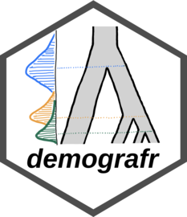

<!-- README.md is generated from README.Rmd. Please edit that file -->

```{r, include = FALSE}
knitr::opts_chunk$set(
  collapse = TRUE,
  comment = "#>",
  fig.path = "man/figures/README-"
)
```

# _demografr_: A simple and efficient ABC toolkit for R

<!-- badges: start -->
<!-- badges: end -->



⚠️&nbsp;**This package is under active development and things often change on short notice.**&nbsp;⚠️

The goal of _demografr_ is to simplify and streamline [Approximate Bayesian Computation](https://en.wikipedia.org/wiki/Approximate_Bayesian_computation) (ABC) in population genetics and make it more reproducible. Additionally, _demografr_ aims to make ABC orders of magnitude faster and more efficient by leveraging the [tree sequences](https://tskit.dev/learn/) as an internal data structure and computation engine.

Unlike traditional ABC approaches, which generally involve custom-built pipelines and scripts for population genetic simulation and computation of summary statistics, _demografr_ makes it possible to perform simulation, data analysis, and ABC inference itself entirely in R within a single reproducible analysis script. By eliminating the need to write custom simulation code and scripting for integration of various population genetic tools for computing summary statistics, it lowers the barrier to entry for new users and facilitates reproducibility for all users regardless of their level of experience by eliminating many common sources of bugs.

### What are the issues with standard ABC?

A traditional ABC analysis in population genetics generally involves:

1. Writing a simulation script tailor-made for the demographic model of species in question using tools such as [ms](http://home.uchicago.edu/rhudson1/source/mksamples.html), [scrm](https://github.com/scrm/scrm/), [msprime](https://github.com/tskit-dev/msprime/), or [SLiM](https://github.com/MesserLab/SLiM/). For most realistic demographic models this presents a significant obstacle unless one is well versed in software development.
2. Developing a pipeline which will draw model parameters from a set of priors, and simulate output data in an appropriate format. Saving output files to disk can be very slow, especially for large genome-scale simulations across thousands of simulation replicates.
3. Computing summary statistics on the simulated data using appropriate software (often a combination of ADMIXTOOLS, PLINK, vcftools, or various custom scripts). This usually requires conversion of simulated outputs to an appropriate file format. In addition to the cost of disk-access, computing summary statistics can be quite slow depending on the statistic or program in question.
4. Feeding (and often re-formatting) the outputs of summary statistics in the right format to use with the appropriate ABC inference engine, such as the R package [_abc_](https://cran.r-project.org/package=abc).

Given the range of disparate tools required for the steps above, traditional ABC pipelines end up being quite complex, require a large amount of programming work and, because of the specifics of each demographic model, the whole procedure is usually re-invented from scratch for each study.

All in all, **an unnecessary amount of time spent on ABC analyses is dedicated to software development&mdash;programming, debugging, and data munging&mdash;work that would be better spent doing research**.

### How does _demografr_ help?

_demografr_ streamlines every step of a typical ABC pipeline by leveraging the [_slendr_](https://github.com/bodkan/slendr/) framework as a building block for simulation and data analysis, making it possible to perform an entire ABC analysis in R. Taking the steps above one by one, here is how _demografr_ makes life easier:

1. _slendr_'s intuitive, interactive [interface for definning population genetic models](https://www.slendr.net/articles/vignette-04-nonspatial-models.html) makes it easy to encode even complex demographic models with only bare minimum of R knowledge needed.
2. _demografr_ makes it possible to encode prior distributions of parameters using familiar R interface resembling standard probabilistic statements, and provides an automated function which simulates ABC replicates drawing parameters from priors in a trivial, one-step manner.
3. Because _slendr_'s simulation output is a [tree sequence](https://tskit.dev/learn/), most population genetic statistics can be computed directly on such tree sequences using R functions which are part of _slendr_'s statistical library. A tree sequence is never saved to disk and no conversion between file formats is required.
4. _demografr_ facilitates tight integration with the powerful R package [_abc_](https://cran.r-project.org/package=abc) by automatically feeding its simulation data to the _abc_ package for inference and analysis.

## Installation

You can install the development version of _demografr_ from [GitHub](https://github.com/) with:

``` r
devtools::install_github("bodkan/demografr")
```

Note that this requires an R package _devtools_, which you can obtain simply by running `install.packages("devtools")`.

Because _demografr_ is tightly linked to the _slendr_ simulation package (in fact, new developments
in _slendr_ ale currently driven by requirements of _demografr_), you will also need the
development version of _slendr_ itself:

``` r
devtools::install_github("bodkan/slendr")
```

### Note on stability

_demografr_ is very much in an early experimental stage at this point. Although ABC fitting of "standard" demographic models (i.e. estimating $N_e$, split times and gene-flow parameters for non-spatial models) already works very nicely, our long-term ambitions for the project are much higher. As such, please be aware that the interface might change significantly on a short notice to accomodate features for estimating parameters of more complex custom models such as spatial models etc.

If you want to follow updates on _demografr_, you can do this also on my [Twitter](https://twitter.com/fleventy5). I am not very active there but I do use it to post notes about all my software projects.

## An example ABC analysis


```{r, echo=FALSE, message=FALSE}
devtools::load_all(".")

data_file <- system.file("examples/01_data.rds", package = "demografr")

diversity_df <- read.table(system.file("examples/01_diversity.tsv", package = "demografr"), header = TRUE)

divergence_df <- read.table(system.file("examples/01_divergence.tsv", package = "demografr"), header = TRUE)
```

Imagine that we sequenced genomes of individuals from populations "popA", "popB", "popC", and "popD".

Let's also assume that we know that the three populations are phylogenetically related in the following way but we don't know anything else (i.e., we have no idea about their $N_e$ or split times):

```{r ape_tree, echo=FALSE, fig.width=5, fig.height=3.5, fig.align="center"}
par(mar = c(0, 0, 0, 0))
tree <- ape::read.tree(text="(popA,(popB,(popC,popD)));")
plot(tree)
```

After sequencing the genomes of individuals from these populations, we computed the nucleotide diversity in these populations as well as their pairwise genetic divergence, and observed the following values which we saved in two standard R data frames:

1. Nucleotide diversity in each population:

```{r}
diversity_df
```

2. Pairwise divergence d_X_Y between populations X and Y:

```{r}
divergence_df
```

### A complete ABC analysis in a single R script

This is how we would use _demografr_ to estimate the $N_e$ and split times for all populations with Approximate Bayesian Computation in a single R script. You will find a more detailed explanation of each step below.

```{r, eval=FALSE, warning=FALSE, message=FALSE}
library(dplyr)
library(slendr)

library(demografr)
init_env()

library(future)
plan(multicore, workers = 80)

#--------------------------------------------------------------------------------
# bind data frames with empirical summary statistics into a named list
observed <- list(diversity = diversity_df, divergence = divergence_df)

#--------------------------------------------------------------------------------
# create a "scaffold model" to be used for fitting parameters
model <- tree_model(tree = "(popA,(popB,(popC,popD)));", time_span = 10000)

#--------------------------------------------------------------------------------
# setup priors for model parameters
priors <- list(
  Ne_popA ~ runif(1, 10000),
  Ne_popB ~ runif(1, 10000),
  Ne_popC ~ runif(1, 10000),
  Ne_popD ~ runif(1, 10000),

  Tsplit_popA_popB ~ runif(1, 3000),
  Tsplit_popB_popC ~ runif(3000, 6000),
  Tsplit_popC_popD ~ runif(6000, 9000)
)

#--------------------------------------------------------------------------------
# define summary functions to be computed on simulated data (must be of the
# same format as the summary statistics computed on empirical data)
compute_diversity <- function(ts) {
  samples <- sample_names(ts, split = TRUE)
  ts_diversity(ts, sample_sets = samples) %>%
    mutate(stat = paste0("pi_", set)) %>%
    select(stat, value = diversity)
}
compute_divergence <- function(ts) {
  samples <- sample_names(ts, split = TRUE)
  ts_divergence(ts, sample_sets = samples) %>%
    mutate(stat = sprintf("d_%s_%s", x, y)) %>%
    select(stat, value = divergence)
}
# the summary functions must be also bound to an R list named in the same
# way as the empirical summary statistics
functions <- list(diversity = compute_diversity, divergence = compute_divergence)

#--------------------------------------------------------------------------------
# run ABC simulations
data <- simulate_abc(
  model, priors, functions, observed, iterations = 10000,
  sequence_length = 10e6, recombination_rate = 1e-8, mutation_rate = 1e-8
)

#--------------------------------------------------------------------------------
# infer posterior distributions of parameters
abc <- perform_abc(data, tolerance = 0.05, method = "neuralnet")
```

```{r, echo=FALSE, eval=file.exists(data_file), warning=FALSE, message=FALSE, results="hide"}
data <- readRDS(system.file("examples/01_data.rds", package = "demografr"))
abc <- perform_abc(data, tolerance = 0.05, method = "neuralnet")
```

## Analysing posterior distributions of parameters

After we run this R script, we end up with an object called `abc` here. This object contains the complete information about the results of our inference. In particular, it carries the posterior samples for our parameters of interest ($N_e$ of populations and their split times).

For instance, we can get a table of all posterior values with the function `extract_summary()`:

```{r}
extract_summary(abc)
```

We can also visualize the posterior distributions. Rather than plotting many different distributions at once, let's first check out the posterior distributions of inferred $N_e$ values:

```{r, posterior_Ne, fig.width=8, fig.height=5}
plot_posterior(abc, type = "Ne")
```

Similarly, we can take a look at the inferred posteriors of the split times:

```{r, posterior_Tsplit, fig.width=8, fig.height=5}
plot_posterior(abc, type = "Tsplit")
```

Finally, we have the diagnostic functionality of the [_abc_](https://cran.r-project.org/web/packages/abc/vignettes/abcvignette.pdf) R package at our disposal:

```{r, diagnostic_Ne, fig.width=10, fig.height=8}
plot(abc, param = "Ne_popC")
```
