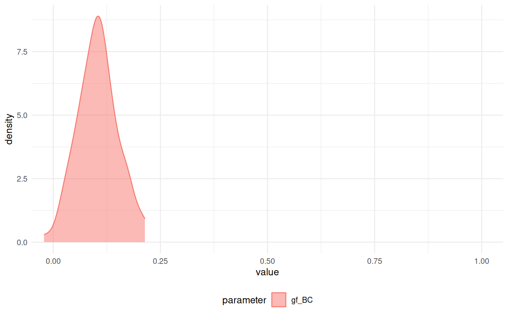
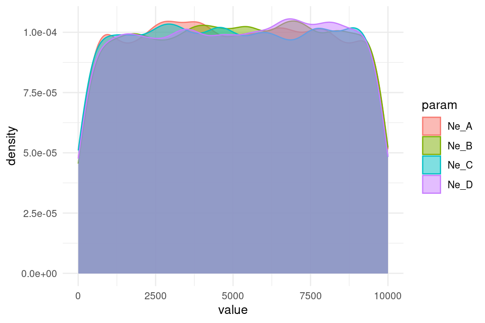

<!-- README.md is generated from README.Rmd. Please edit that file -->


# _demografr_: Simulation-based inference in population genetics
<!-- badges: start -->
<!-- badges: end -->


⚠️⚠️⚠️

**Please note that _demografr_ is still under active development. Although it's being successfully used in ongoing research projects in my group, the interface does occasionally change on rather short notice (function names, function arguments, etc.). I recommend that you keep an eye on the changelog for the list of the most recent updates.**

⚠️⚠️⚠️

The goal of _demografr_ is to simplify and streamline [Approximate Bayesian Computation](https://en.wikipedia.org/wiki/Approximate_Bayesian_computation) (ABC) in population genetics and make it more reproducible. Additionally, _demografr_ aims to make ABC orders of magnitude faster and more efficient by leveraging the [tree sequences](https://tskit.dev/learn/) as an internal data structure and computation engine.

Unlike traditional ABC approaches, which generally involve custom-built pipelines and scripts for population genetic simulation and computation of summary statistics, _demografr_ makes it possible to perform simulation, data analysis, and ABC inference itself entirely in R within a single reproducible analysis script. By eliminating the need to write custom simulation code and scripting for integration of various population genetic tools for computing summary statistics, it lowers the barrier to entry for new users and facilitates reproducibility for all users regardless of their level of experience by eliminating many common sources of bugs.

### How does _demografr_ help with ABC?

_demografr_ streamlines every step of a typical ABC pipeline by leveraging the [_slendr_](https://github.com/bodkan/slendr/) framework as a building block for simulation and data analysis, making it possible to write complete ABC workflows in R. Specifically:

1. _slendr_'s intuitive, interactive [interface for definning population genetic models](https://www.slendr.net/articles/vignette-04-nonspatial-models.html) makes it easy to encode even complex demographic models with only bare minimum of R knowledge needed.
2. _demografr_ makes it possible to encode prior distributions of parameters using familiar R interface resembling standard probabilistic statements, and provides an automated function which simulates ABC replicates drawing parameters from priors in a trivial, one-step manner.
3. Because _slendr_'s simulation output is a [tree sequence](https://tskit.dev/learn/), most population genetic statistics can be computed directly on such tree sequences using R functions which are part of _slendr_'s statistical library. A tree sequence is never saved to disk and no conversion between file formats is required.
4. _demografr_ facilitates tight integration with the powerful R package [_abc_](https://cran.r-project.org/package=abc) by automatically feeding its simulation data to the _abc_ package for inference and analysis.

## Installation

You can install the development version of _demografr_ from [GitHub](https://github.com/) with:

``` r
devtools::install_github("bodkan/demografr")
```

Note that this requires an R package _devtools_, which you can obtain simply by running `install.packages("devtools")`.

Because _demografr_ is tightly linked to the _slendr_ simulation package (in fact, new developments
in _slendr_ ale currently driven by requirements of _demografr_), you will also need the
development version of _slendr_ itself:

``` r
devtools::install_github("bodkan/slendr")
```

### Note on stability

_demografr_ is very much in an early experimental stage at this point. Although ABC fitting of "standard" demographic models (i.e. estimating $N_e$, split times and gene-flow parameters for non-spatial models) already works very nicely, our long-term ambitions for the project are much higher. As such, please be aware that the interface might change significantly on a short notice to accomodate features for estimating parameters of more complex custom models such as spatial models etc.

If you want to follow updates on _demografr_, you can do this also on my [Mastodon](https://fosstodon.org/@bodkan).

## Important pieces missing so far

Tying the results of _demografr_ ABC inference (internally facilitated by the _abc_ package) to various diagnostics features of _abc_ and other tools.

## An example ABC analysis

Imagine that we sequenced genomes of individuals from populations "popA", "popB", "popC", and "popD".

Let's also assume that we know that the three populations are phylogenetically related in the following way with an indicated gene-flow event at a certain time in the past, but we don't know anything else (i.e., we have no idea about their $N_e$ or split times):


After sequencing the genomes of individuals from these populations, we computed the nucleotide diversity in these populations as well as their pairwise genetic divergence, and observed the following values which we saved in two standard R data frames:

1. Nucleotide diversity in each population:


```r
observed_diversity <- read.table(system.file("examples/observed_diversity.tsv", package = "demografr"), header = TRUE)

observed_diversity
#>    set    diversity
#> 1 popA 8.138167e-05
#> 2 popB 3.262781e-05
#> 3 popC 1.010541e-04
#> 4 popD 8.963820e-05
```

2. Pairwise divergence d_X_Y between populations X and Y:


```r
observed_divergence <- read.table(system.file("examples/observed_divergence.tsv", package = "demografr"), header = TRUE)

observed_divergence
#>      x    y   divergence
#> 1 popA popB 0.0002442102
#> 2 popA popC 0.0002443844
#> 3 popA popD 0.0002448539
#> 4 popB popC 0.0001099973
#> 5 popB popD 0.0001160577
#> 6 popC popD 0.0001099985
```

3. Value of the following $f_4$-statistic:


```r
observed_f4  <- read.table(system.file("examples/observed_f4.tsv", package = "demografr"), header = TRUE)

observed_f4
#>      W    X    Y    Z            f4
#> 1 popA popB popC popD -2.796781e-06
```

### A complete ABC analysis in a single R script

This is how we would use _demografr_ to estimate the $N_e$ and split times for all populations (and the rate of the indicated gene-flow event) with Approximate Bayesian Computation in a single R script:


```r
library(demografr)
library(slendr)

# set up the internal tskit/msprime environment
init_env()

# set up parallelization across all CPUs on the current machine
library(future)
plan(multicore, workers = availableCores())

#--------------------------------------------------------------------------------
# bind data frames with empirical summary statistics into a named list
observed <- list(
  diversity  = observed_diversity,
  divergence = observed_divergence,
  f4         = observed_f4
)

#--------------------------------------------------------------------------------
# define a model generating function using the slendr interface
# (each of the function parameters correspond to a parameter we want to infer)

model <- function(Ne_A, Ne_B, Ne_C, Ne_D, T_AB, T_BC, T_CD, gf_BC) {
  # define populations
  popA <- population("popA", time = 1,    N = Ne_A)
  popB <- population("popB", time = T_AB, N = Ne_B, parent = popA)
  popC <- population("popC", time = T_BC, N = Ne_C, parent = popB)
  popD <- population("popD", time = T_CD, N = Ne_D[1], parent = popC)

  # define gene-flow events
  gf <- gene_flow(from = popB, to = popC, start = 9000, end = 9301, rate = gf_BC)

  # compile a slendr model
  model <- compile_model(
    populations = list(popA, popB, popC, popD), gene_flow = gf,
    generation_time = 1, simulation_length = 10000,
    direction = "forward", serialize = FALSE
  )

  # set up sampling schedule (2 diploid individuals from each population at
  # the end of the simulation) -- this step is optional
  samples <- schedule_sampling(
    model, times = 10000,
    list(popA, 2), list(popB, 2), list(popC, 2), list(popD, 2),
    strict = TRUE
  )

  # a return statement is mandatory!
  # if a sampling schedule is not generated, use return(model)
  return(list(model, samples))
}

#--------------------------------------------------------------------------------
# setup priors for model parameters

priors <- list(
  Ne_A ~ runif(1, 10000),
  Ne_B ~ runif(1, 10000),
  Ne_C ~ runif(1, 10000),
  Ne_D ~ runif(1, 10000),

  T_AB ~ runif(1, 10000),
  T_BC ~ runif(1, 10000),
  T_CD ~ runif(1, 10000),

  gf_BC ~ runif(0, 1)
)

#--------------------------------------------------------------------------------
# define summary functions to be computed on simulated data (must be of the
# same format as the summary statistics computed on empirical data)

compute_diversity <- function(ts) {
  samples <- extract_names(ts, split = "pop")
  ts_diversity(ts, sample_sets = samples)
}
compute_divergence <- function(ts) {
  samples <- extract_names(ts, split = "pop")
  ts_divergence(ts, sample_sets = samples)
}
compute_f4 <- function(ts) {
  samples <- extract_names(ts, split = "pop")
  ts_f4(ts,
        W = list(popA = samples$popA),
        X = list(popB = samples$popB),
        Y = list(popC = samples$popC),
        Z = list(popD = samples$popD))
}

# the summary functions must be also bound to an R list named in the same
# way as the empirical summary statistics
functions <- list(
  diversity  = compute_diversity,
  divergence = compute_divergence,
  f4         = compute_f4
)

#--------------------------------------------------------------------------------
# validate the individual ABC components for correctness and consistency
validate_abc(model, priors, functions, observed)

#--------------------------------------------------------------------------------
# run ABC simulations
data <- simulate_abc(
  model, priors, functions, observed, iterations = 10000,
  sequence_length = 10e6, recombination_rate = 1e-8, mutation_rate = 1e-8
)

#--------------------------------------------------------------------------------
# infer posterior distributions of parameters using the abc R package
abc <- perform_abc(data, engine = "abc", tol = 0.03, method = "neuralnet")
```


## Analysing posterior distributions of parameters

After we run this R script, we end up with an object called `abc` here. This object contains the complete information about the results of our inference. In particular, it carries the posterior samples for our parameters of interest ($N_e$ of populations and their split times).

For instance, we can get a table of all posterior values with the function `extract_summary()`:


```r
extract_summary(abc)
#>                               Ne_A      Ne_B      Ne_C      Ne_D      T_AB
#> Min.:                    -3.010207  574.2056 -1453.896 -509.7813  556.2759
#> Weighted 2.5 % Perc.:   474.550342  655.4132  1262.466 2227.0248 1195.4049
#> Weighted Median:       1782.484402  908.4085  5476.699 4125.2670 1869.9525
#> Weighted Mean:         1840.627399  946.8585  5594.961 4140.8364 1884.1942
#> Weighted Mode:         1454.772471  789.5067  5053.863 4255.9646 1862.5793
#> Weighted 97.5 % Perc.: 3424.879882 1313.6176 10166.234 5997.0714 2672.8709
#> Max.:                  4030.283888 1516.9037 13445.633 7485.2941 3279.5452
#>                            T_BC      T_CD       gf_BC
#> Min.:                  2271.210  4921.490 -0.17303098
#> Weighted 2.5 % Perc.:  3359.665  6131.964  0.04465324
#> Weighted Median:       5369.389  8262.425  0.28803288
#> Weighted Mean:         5271.758  8209.992  0.31888803
#> Weighted Mode:         5420.005  8540.382  0.24631980
#> Weighted 97.5 % Perc.: 6301.992  9946.337  0.69010571
#> Max.:                  6754.829 10636.425  0.87366466
```

We can also specify a subset of model parameters to select, or provide a regular expression for this subsetting:


```r
extract_summary(abc, param = "Ne")
#>                               Ne_A      Ne_B      Ne_C      Ne_D
#> Min.:                    -3.010207  574.2056 -1453.896 -509.7813
#> Weighted 2.5 % Perc.:   474.550342  655.4132  1262.466 2227.0248
#> Weighted Median:       1782.484402  908.4085  5476.699 4125.2670
#> Weighted Mean:         1840.627399  946.8585  5594.961 4140.8364
#> Weighted Mode:         1454.772471  789.5067  5053.863 4255.9646
#> Weighted 97.5 % Perc.: 3424.879882 1313.6176 10166.234 5997.0714
#> Max.:                  4030.283888 1516.9037 13445.633 7485.2941
```

We can also visualize the posterior distributions. Rather than plotting many different distributions at once, let's first check out the posterior distributions of inferred $N_e$ values:


```r
plot_posterior(abc, param = "Ne")
```


Similarly, we can take a look at the inferred posteriors of the split times:


```r
plot_posterior(abc, param = "T")
```


And, finally, the rate of gene flow:


```r
plot_posterior(abc, param = "gf")
```



Finally, we have the diagnostic functionality of the [_abc_](https://cran.r-project.org/package=abc) R package at our disposal:


```r
plot(abc, param = "Ne_C")
```


## Additional functionality

_demografr_ also provides a couple of functions designed to make troubleshooting a little easier.

For instance, assuming we have `priors` set up as above, we can visualize the prior distribution(s) like this:


```r
plot_prior(priors, "Ne")
```




```r
plot_prior(priors, c("^T", "^gf"), facet = TRUE)
```


