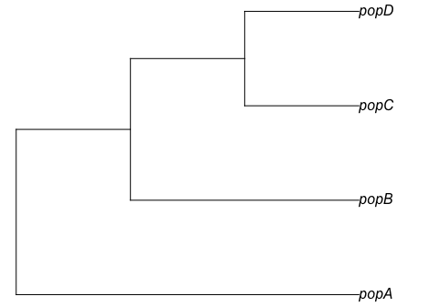
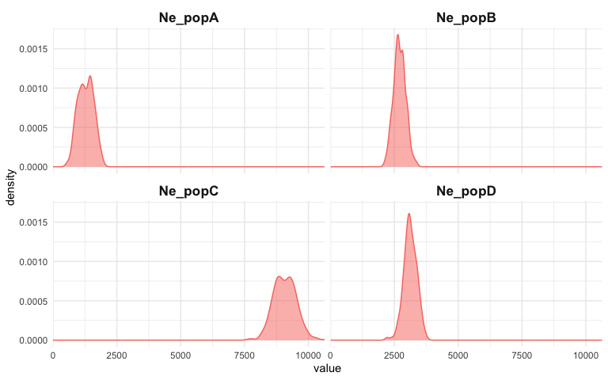
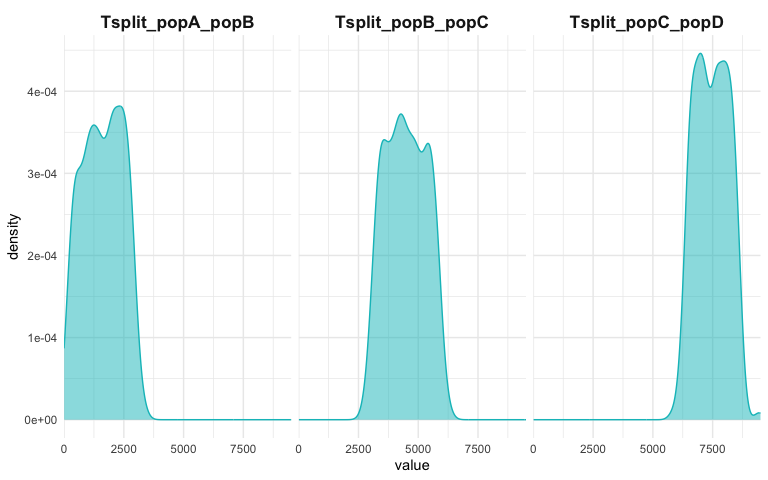
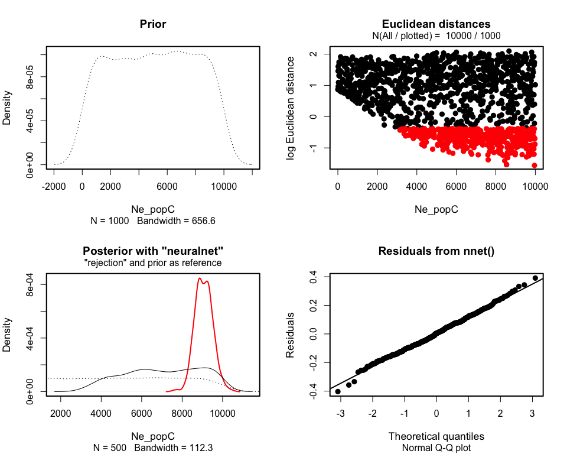

<!-- README.md is generated from README.Rmd. Please edit that file -->

# *demografr*: A simple and efficient ABC toolkit for R

<!-- badges: start -->
<!-- badges: end -->


⚠️⚠️⚠️

**This package is under active development and things often change (and
break) on short notice! You probably shouldn’t be using *demografr* in
your own modeling projects at this point.**

**A more stable version and a preprint will be ready sometime in summer
2023. Feedback is most welcome!**

⚠️⚠️⚠️

The goal of *demografr* is to simplify and streamline [Approximate
Bayesian
Computation](https://en.wikipedia.org/wiki/Approximate_Bayesian_computation)
(ABC) in population genetics and make it more reproducible.
Additionally, *demografr* aims to make ABC orders of magnitude faster
and more efficient by leveraging the [tree
sequences](https://tskit.dev/learn/) as an internal data structure and
computation engine.

Unlike traditional ABC approaches, which generally involve custom-built
pipelines and scripts for population genetic simulation and computation
of summary statistics, *demografr* makes it possible to perform
simulation, data analysis, and ABC inference itself entirely in R within
a single reproducible analysis script. By eliminating the need to write
custom simulation code and scripting for integration of various
population genetic tools for computing summary statistics, it lowers the
barrier to entry for new users and facilitates reproducibility for all
users regardless of their level of experience by eliminating many common
sources of bugs.

### How does *demografr* help with ABC?

*demografr* streamlines every step of a typical ABC pipeline by
leveraging the [*slendr*](https://github.com/bodkan/slendr/) framework
as a building block for simulation and data analysis, making it possible
to write complete ABC workflows in R. Specifically:

1.  *slendr*’s intuitive, interactive [interface for definning
    population genetic
    models](https://www.slendr.net/articles/vignette-04-nonspatial-models.html)
    makes it easy to encode even complex demographic models with only
    bare minimum of R knowledge needed.
2.  *demografr* makes it possible to encode prior distributions of
    parameters using familiar R interface resembling standard
    probabilistic statements, and provides an automated function which
    simulates ABC replicates drawing parameters from priors in a
    trivial, one-step manner.
3.  Because *slendr*’s simulation output is a [tree
    sequence](https://tskit.dev/learn/), most population genetic
    statistics can be computed directly on such tree sequences using R
    functions which are part of *slendr*’s statistical library. A tree
    sequence is never saved to disk and no conversion between file
    formats is required.
4.  *demografr* facilitates tight integration with the powerful R
    package [*abc*](https://cran.r-project.org/package=abc) by
    automatically feeding its simulation data to the *abc* package for
    inference and analysis.

## Installation

You can install the development version of *demografr* from
[GitHub](https://github.com/) with:

``` r
devtools::install_github("bodkan/demografr")
```

Note that this requires an R package *devtools*, which you can obtain
simply by running `install.packages("devtools")`.

Because *demografr* is tightly linked to the *slendr* simulation package
(in fact, new developments in *slendr* ale currently driven by
requirements of *demografr*), you will also need the development version
of *slendr* itself:

``` r
devtools::install_github("bodkan/slendr")
```

### Note on stability

*demografr* is very much in an early experimental stage at this point.
Although ABC fitting of “standard” demographic models (i.e. estimating
$N_e$, split times and gene-flow parameters for non-spatial models)
already works very nicely, our long-term ambitions for the project are
much higher. As such, please be aware that the interface might change
significantly on a short notice to accomodate features for estimating
parameters of more complex custom models such as spatial models etc.

If you want to follow updates on *demografr*, you can do this also on my
[Twitter](https://twitter.com/fleventy5). I am not very active there but
I do use it to post notes about all my software projects.

## Important pieces missing so far

Currently in progress:

1.  Support for temporal sampling via *slendr*’s
    [schedule_sampling()](https://www.slendr.net/reference/schedule_sampling.html).

2.  Implement flexible time units for model parameters as supported by
    *slendr* (years ago, generations forwards in time, years into the
    future, etc.).

3.  Implement rejection of non-sensical parameter combinations (daughter
    populations existing before parent populations, etc.). Easy to solve
    internally in `simulate_abc()`, it just hasn’t happened yet.

## An example ABC analysis

Imagine that we sequenced genomes of individuals from populations
“popA”, “popB”, “popC”, and “popD”.

Let’s also assume that we know that the populations are
phylogenetically related in the following way with an indicated
gene-flow event at a certain time in the past, but we don’t know
anything else (i.e., we have no idea about their $N_e$ or split times):



After sequencing the genomes of individuals from these populations, we
computed the nucleotide diversity in these populations as well as their
pairwise genetic divergence, and observed the following values which we
saved in two standard R data frames:

1.  Nucleotide diversity in each population:

``` r
observed_diversity <- read.table(system.file("examples/observed_diversity.tsv", package = "demografr"), header = TRUE)

observed_diversity
#>    set    diversity
#> 1 popA 8.079807e-05
#> 2 popB 3.324979e-05
#> 3 popC 1.024510e-04
#> 4 popD 9.024937e-05
```

2.  Pairwise divergence d_X\_Y between populations X and Y:

``` r
observed_divergence <- read.table(system.file("examples/observed_divergence.tsv", package = "demografr"), header = TRUE)

observed_divergence
#>      x    y   divergence
#> 1 popA popB 0.0002413010
#> 2 popA popC 0.0002409678
#> 3 popA popD 0.0002407488
#> 4 popB popC 0.0001114809
#> 5 popB popD 0.0001151775
#> 6 popC popD 0.0001114729
```

3.  Value of the following $f_4$-statistic:

``` r
observed_f4  <- read.table(system.file("examples/observed_f4.tsv", package = "demografr"), header = TRUE)

observed_f4
#>      W    X    Y    Z            f4
#> 1 popA popB popC popD -1.959654e-06
```

### A complete ABC analysis in a single R script

This is how we would use *demografr* to estimate the $N_e$ and split
times for all populations (and the rate of the indicated gene-flow
event) with Approximate Bayesian Computation in a single R script:

``` r
library(demografr)
library(slendr)

# set up the internal tskit/msprime environment
init_env()

# set up parallelization across 80 CPUs
future::plan("multicore", workers = 80)

#--------------------------------------------------------------------------------
# bind data frames with empirical summary statistics into a named list
observed <- list(
  diversity  = observed_diversity,
  divergence = observed_divergence,
  f4         = observed_f4
)

#--------------------------------------------------------------------------------
# define a model generating function using the slendr interface
# (each of the function parameters correspond to a parameter we want to infer)
model <- function(Ne_A, Ne_B, Ne_C, Ne_D, T_AB, T_BC, T_CD, gf_BC) {
  popA <- population("popA", time = 1,    N = Ne_A)
  popB <- population("popB", time = T_AB, N = Ne_B, parent = popA)
  popC <- population("popC", time = T_BC, N = Ne_C, parent = popB)
  popD <- population("popD", time = T_CD, N = Ne_D, parent = popC)

  gf <- gene_flow(from = popB, to = popC, start = 9000, end = 9301, rate = gf_BC)

  compile_model(
    populations = list(popA, popB, popC, popD), gene_flow = gf,
    generation_time = 1, simulation_length = 10000,
    serialize = FALSE
  )
}

#--------------------------------------------------------------------------------
# setup priors for model parameters
priors <- list(
  Ne_A ~ runif(100, 10000),
  Ne_B ~ runif(100, 10000),
  Ne_C ~ runif(100, 10000),
  Ne_D ~ runif(100, 10000),

  T_AB ~ runif(1, 3000),
  T_BC ~ runif(3000, 6000),
  T_CD ~ runif(6000, 9000),

  gf_BC ~ runif(0, 1)
)

#--------------------------------------------------------------------------------
# define summary functions to be computed on simulated data (must be of the
# same format as the summary statistics computed on empirical data)
compute_diversity <- function(ts) {
  samples <- sample_names(ts, split = TRUE)
  ts_diversity(ts, sample_sets = samples)
}
compute_divergence <- function(ts) {
  samples <- sample_names(ts, split = TRUE)
  ts_divergence(ts, sample_sets = samples)
}
compute_f4 <- function(ts) {
  samples <- sample_names(ts, split = TRUE)
  ts_f4(ts,
        W = list(popA = samples$popA),
        X = list(popB = samples$popB),
        Y = list(popC = samples$popC),
        Z = list(popD = samples$popD))
}
# the summary functions must be also bound to an R list named in the same
# way as the empirical summary statistics
functions <- list(
  diversity  = compute_diversity,
  divergence = compute_divergence,
  f4         = compute_f4
)

#--------------------------------------------------------------------------------
# validate the individual ABC components for correctness and consistency
validate_abc(model, priors, functions, observed)

#--------------------------------------------------------------------------------
# run ABC simulations
data <- simulate_abc(
  model, priors, functions, observed, iterations = 10000,
  sequence_length = 10e6, recombination_rate = 1e-8, mutation_rate = 1e-8
)

#--------------------------------------------------------------------------------
# infer posterior distributions of parameters
# (accepts all parameters of the abc() function from the R package abc)
abc <- perform_abc(data, tolerance = 0.05, method = "neuralnet")
```

## Analysing posterior distributions of parameters

After we run this R script, we end up with an object called `abc` here.
This object contains the complete information about the results of our
inference. In particular, it carries the posterior samples for our
parameters of interest ($N_e$ of populations and their split times).

For instance, we can get a table of all posterior values with the
function `extract_summary()`:

``` r
extract_summary(abc)
#>                             Ne_A      Ne_B      Ne_C     Ne_D     T_AB     T_BC
#> Min.:                  -154.4357 -160.5012  6598.914 1985.970 1025.790 3484.310
#> Weighted 2.5 % Perc.:   335.6717  369.1727  7089.719 2998.958 1310.410 4645.530
#> Weighted Median:       1424.7351 1076.7693  8390.820 4426.852 1866.135 5641.544
#> Weighted Mean:         1567.8079 1208.1039  8503.661 4421.920 1869.542 5593.608
#> Weighted Mode:          987.7037  777.8807  8112.488 4615.830 1773.348 5704.552
#> Weighted 97.5 % Perc.: 3483.0220 2301.1048 10317.553 6156.445 2431.848 6327.303
#> Max.:                  4549.4227 3901.0760 13381.965 9293.825 3249.039 6508.854
#>                            T_CD       gf_BC
#> Min.:                  6531.469 -0.01748597
#> Weighted 2.5 % Perc.:  7206.961  0.05997223
#> Weighted Median:       7694.990  0.26453025
#> Weighted Mean:         7698.733  0.27380456
#> Weighted Mode:         7702.070  0.20913922
#> Weighted 97.5 % Perc.: 8232.677  0.53079048
#> Max.:                  8741.145  0.81055566
```

We can also visualize the posterior distributions. Rather than plotting
many different distributions at once, let’s first check out the
posterior distributions of inferred $N_e$ values:

``` r
plot_posterior(abc, prefix = "Ne")
#> Warning: Removed 2 rows containing non-finite values (`stat_density()`).
```

<!-- -->

Similarly, we can take a look at the inferred posteriors of the split
times:

``` r
plot_posterior(abc, prefix = "T")
```

<!-- -->

Finally, we have the diagnostic functionality of the
[*abc*](https://cran.r-project.org/web/packages/abc/vignettes/abcvignette.pdf)
R package at our disposal:

``` r
plot(abc, param = "Ne_C")
```

<!-- -->
