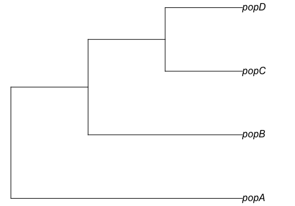
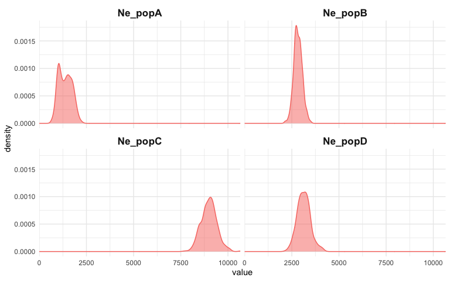
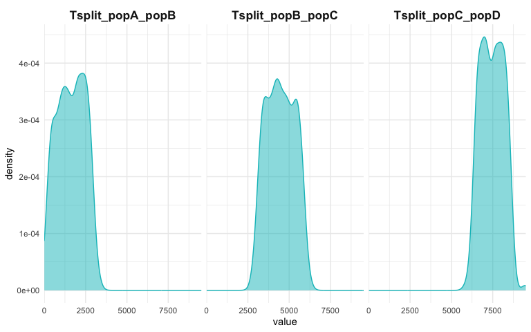
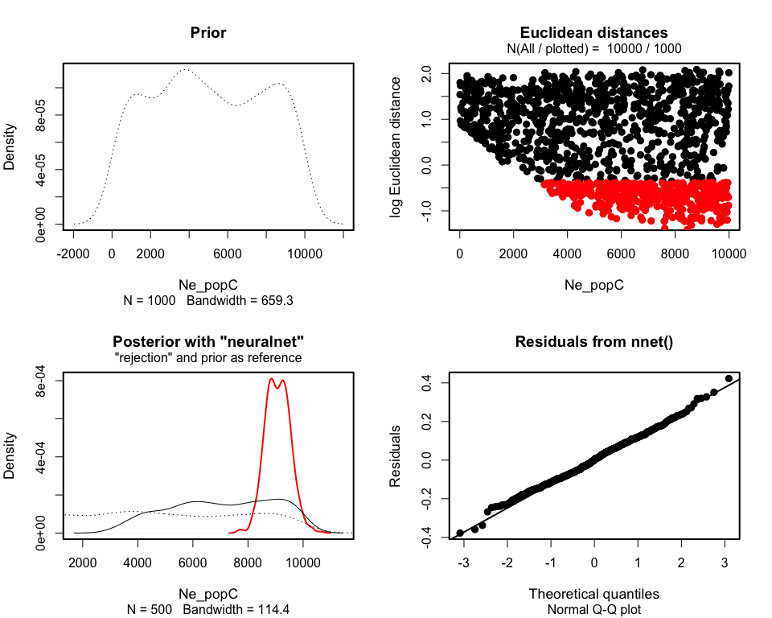

<!-- README.md is generated from README.Rmd. Please edit that file -->

# *demografr*: A simple and efficient ABC toolkit for R

<!-- badges: start -->
<!-- badges: end -->


⚠️ **This package is under active development and things often change on
short notice.** ⚠️

The goal of *demografr* is to simplify and streamline [Approximate
Bayesian
Computation](https://en.wikipedia.org/wiki/Approximate_Bayesian_computation)
(ABC) in population genetics and make it more reproducible.
Additionally, *demografr* aims to make ABC orders of magnitude faster
and more efficient by leveraging the [tree
sequences](https://tskit.dev/learn/) as an internal data structure and
computation engine.

Unlike traditional ABC approaches, which generally involve custom-built
pipelines and scripts for population genetic simulation and computation
of summary statistics, *demografr* makes it possible to perform
simulation, data analysis, and ABC inference itself entirely in R within
a single reproducible analysis script. By eliminating the need to write
custom simulation code and scripting for integration of various
population genetic tools for computing summary statistics, it lowers the
barrier to entry for new users and facilitates reproducibility for all
users regardless of their level of experience by eliminating many common
sources of bugs.

### What are the issues with standard ABC?

A traditional ABC analysis in population genetics generally involves:

1.  Writing a simulation script tailor-made for the demographic model of
    species in question using tools such as
    [ms](http://home.uchicago.edu/rhudson1/source/mksamples.html),
    [scrm](https://github.com/scrm/scrm/),
    [msprime](https://github.com/tskit-dev/msprime/), or
    [SLiM](https://github.com/MesserLab/SLiM/). For most realistic
    demographic models this presents a significant obstacle unless one
    is well versed in software development.
2.  Developing a pipeline which will draw model parameters from a set of
    priors, and simulate output data in an appropriate format. Saving
    output files to disk can be very slow, especially for large
    genome-scale simulations across thousands of simulation replicates.
3.  Computing summary statistics on the simulated data using appropriate
    software (often a combination of ADMIXTOOLS, PLINK, vcftools, or
    various custom scripts). This usually requires conversion of
    simulated outputs to an appropriate file format. In addition to the
    cost of disk-access, computing summary statistics can be quite slow
    depending on the statistic or program in question.
4.  Feeding (and often re-formatting) the outputs of summary statistics
    in the right format to use with the appropriate ABC inference
    engine, such as the R package
    [*abc*](https://cran.r-project.org/package=abc).

Given the range of disparate tools required for the steps above,
traditional ABC pipelines end up being quite complex, require a large
amount of programming work and, because of the specifics of each
demographic model, the whole procedure is usually re-invented from
scratch for each study.

All in all, **an unnecessary amount of time spent on ABC analyses is
dedicated to software development—programming, debugging, and data
munging—work that would be better spent doing research**.

### How does *demografr* help?

*demografr* streamlines every step of a typical ABC pipeline by
leveraging the [*slendr*](https://github.com/bodkan/slendr/) framework
as a building block for simulation and data analysis, making it possible
to perform an entire ABC analysis in R. Taking the steps above one by
one, here is how *demografr* makes life easier:

1.  *slendr*’s intuitive, interactive [interface for definning
    population genetic
    models](https://www.slendr.net/articles/vignette-04-nonspatial-models.html)
    makes it easy to encode even complex demographic models with only
    bare minimum of R knowledge needed.
2.  *demografr* makes it possible to encode prior distributions of
    parameters using familiar R interface resembling standard
    probabilistic statements, and provides an automated function which
    simulates ABC replicates drawing parameters from priors in a
    trivial, one-step manner.
3.  Because *slendr*’s simulation output is a [tree
    sequence](https://tskit.dev/learn/), most population genetic
    statistics can be computed directly on such tree sequences using R
    functions which are part of *slendr*’s statistical library. A tree
    sequence is never saved to disk and no conversion between file
    formats is required.
4.  *demografr* facilitates tight integration with the powerful R
    package [*abc*](https://cran.r-project.org/package=abc) by
    automatically feeding its simulation data to the *abc* package for
    inference and analysis.

## Installation

You can install the development version of *demografr* from
[GitHub](https://github.com/) with:

``` r
devtools::install_github("bodkan/demografr")
```

Note that this requires an R package *devtools*, which you can obtain
simply by running `install.packages("devtools")`.

### Note on stability

*demografr* is very much in an early experimental stage at this point.
Although ABC fitting of “standard” demographic models (i.e. estimating
$N_e$, split times and gene-flow parameters for non-spatial models)
already works very nicely, our long-term ambitions for the project are
much higher. As such, please be aware that the interface might change
significantly on a short notice to accomodate features for estimating
parameters of more complex custom models such as spatial models etc.

## An example ABC analysis

Imagine that we sequenced genomes of individuals from three populations
“p1”, “p2”, and “p3”.

Let’s also assume that we know that the three populations are
phylogenetically related in the following way but we don’t know anything
else (i.e., we have no idea about their $N_e$ or split times):



After sequencing the genomes of individuals from these populations, we
computed the nucleotide diversity in these populations as well as their
pairwise genetic divergence, and observed the following values which we
saved in two standard R data frames:

1.  Nucleotide diversity in each population:

``` r
diversity_df
#>      stat        value
#> 1 pi_popA 3.962604e-05
#> 2 pi_popB 9.827821e-05
#> 3 pi_popC 1.501280e-04
#> 4 pi_popD 1.286567e-04
```

2.  Pairwise divergence d_X\_Y between populations X and Y:

``` r
divergence_df
#>          stat        value
#> 1 d_popA_popB 0.0001984640
#> 2 d_popA_popC 0.0001991969
#> 3 d_popA_popD 0.0001999640
#> 4 d_popB_popC 0.0001825852
#> 5 d_popB_popD 0.0001832798
#> 6 d_popC_popD 0.0001754839
```

### A complete ABC analysis in a single R script

This is how we would use *demografr* to estimate the $N_e$ and split
times for all populations with Approximate Bayesian Computation in a
single R script. You will find a more detailed explanation of each step
below.

``` r
library(dplyr)
library(slendr)

library(demografr)

#--------------------------------------------------------------------------------
# bind data frames with empirical summary statistics into a named list
observed <- list(diversity = diversity_df, divergence = divergence_df)

#--------------------------------------------------------------------------------
# create a "scaffold model" to be used for fitting parameters
model <- tree_model("(popA,(popB,(popC,popD)));", time_span = 10000)

#--------------------------------------------------------------------------------
# setup priors for model parameters
priors <- list(
  Ne_popA ~ runif(1, 10000),
  Ne_popB ~ runif(1, 10000),
  Ne_popC ~ runif(1, 10000),
  Ne_popD ~ runif(1, 10000),

  Tsplit_popA_popB ~ runif(1, 3000),
  Tsplit_popB_popC ~ runif(3000, 6000),
  Tsplit_popC_popD ~ runif(6000, 9000)
)

#--------------------------------------------------------------------------------
# define summary functions to be computed on simulated data (must be of the
# same format as the summary statistics computed on empirical data)
compute_diversity <- function(ts) {
  samples <- ts_samples(ts) %>% split(., .$pop) %>% lapply(`[[`, "name")
  ts_diversity(ts, sample_sets = samples) %>%
    mutate(stat = paste0("pi_", set)) %>%
    select(stat, value = diversity)
}
compute_divergence <- function(ts) {
  samples <- ts_samples(ts) %>% split(., .$pop) %>% lapply(`[[`, "name")
  ts_divergence(ts, sample_sets = samples) %>%
    mutate(stat = sprintf("d_%s_%s", x, y)) %>%
    select(stat, value = divergence)
}
# the summary functions must be also bound to an R list named in the same
# way as the empirical summary statistics
functions <- list(diversity = compute_diversity, divergence = compute_divergence)

#--------------------------------------------------------------------------------
# run ABC simulations
data <- simulate_abc(
  model, priors, functions, observed, iterations = 10000,
  sequence_length = 10e6, recombination_rate = 1e-8, mutation_rate = 1e-8
)

#--------------------------------------------------------------------------------
# infer posterior distributions of parameters
abc <- perform_abc(data, tolerance = 0.05, method = "neuralnet")
```

## Analysing posterior distributions of parameters

After we run this R script, we end up with an object called `abc` here.
This object contains the complete information about the results of our
inference. In particular, it carries the posterior samples for our
parameters of interest ($N_e$ of populations and their split times).

For instance, we can get a table of all posterior values with the
function `extract_summary()`:

``` r
extract_summary(abc)
#>                          Ne_popA  Ne_popB   Ne_popC  Ne_popD Tsplit_popA_popB
#> Min.:                   456.0585 1966.680  7467.562 1685.810      -202.808909
#> Weighted 2.5 % Perc.:   980.6422 2143.553  8131.701 2464.793        -4.242878
#> Weighted Median:       1390.0411 2588.580  8883.315 3170.381      1488.916069
#> Weighted Mean:         1410.1825 2600.790  8886.597 3198.226      1465.537013
#> Weighted Mode:         1126.1015 2599.003  8922.075 3084.364      2274.076814
#> Weighted 97.5 % Perc.: 1921.3738 3153.541  9720.414 3944.046      2878.473675
#> Max.:                  2126.8775 3544.456 10150.891 4372.277      3184.741115
#>                        Tsplit_popB_popC Tsplit_popC_popD
#> Min.:                          2798.508         5991.981
#> Weighted 2.5 % Perc.:          3036.407         6798.146
#> Weighted Median:               4457.787         8059.935
#> Weighted Mean:                 4435.278         8031.826
#> Weighted Mode:                 4688.047         8294.431
#> Weighted 97.5 % Perc.:         5885.709         9226.172
#> Max.:                          6267.799         9575.897
```

We can also visualize the posterior distributions. Rather than plotting
many different distributions at once, let’s first check out the
posterior distributions of inferred $N_e$ values:

``` r
plot_posterior(abc, type = "Ne")
```

<!-- -->

Similarly, we can take a look at the inferred posteriors of the split
times:

``` r
plot_posterior(abc, type = "Tsplit")
#> Warning: Removed 18 rows containing non-finite values (stat_density).
```

<!-- -->

Finally, we have the diagnostic functionality of the
[*abc*](https://cran.r-project.org/web/packages/abc/vignettes/abcvignette.pdf)
R package at our disposal:

``` r
plot(abc, param = "Ne_popC")
```

<!-- -->
