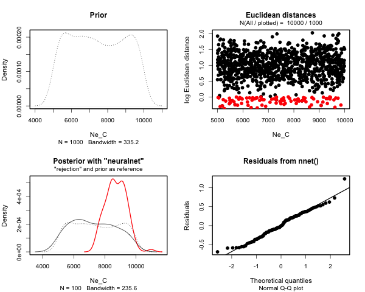

<!-- README.md is generated from README.Rmd. Please edit that file -->


# _demografr_: Simulation-based inference for population genetics

<!-- badges: start -->

<!--[](https://cran.r-project.org/package=slendr) [](https://cran.r-project.org/package=slendr) -->

[](https://github.com/bodkan/demografr/actions) [](http://beta.mybinder.org/v2/gh/bodkan/demografr/main?urlpath=rstudio) [](https://app.codecov.io/github/bodkan/demografr?branch=main)

<!-- badges: end -->

⚠️⚠️⚠️

**Please note that until a peer reviewed publication describing the
_demografr_ package is published, the software should be regarded as 
experimental and potentially unstable.**

⚠️️⚠️⚠️

The goal of _demografr_ is to simplify and streamline the development of
simulation-based inference pipelines in population genetics and evolutionary
biology, such as [Approximate Bayesian Computation](https://en.wikipedia.org/wiki/Approximate_Bayesian_computation)
(ABC) or parameter grid inferences, and make them more reproducible.
_demografr_ also aims to make these inferences orders of magnitude faster and
more efficient by leveraging the [tree sequences](https://tskit.dev/learn/) as
an internal data structure and computation engine.

Unlike traditional ABC and other simulation-based approaches, which generally
involve custom-built pipelines and scripts for population genetic simulation
and computation of summary statistics, _demografr_ makes it possible to perform
simulation, computation of summary statistics, and the inference itself
entirely in R within a single reproducible analysis script. By eliminating
the need to write custom simulation code and scripting for integration of
various population genetic tools for computing summary statistics, it lowers
the barrier for new users and facilitates reproducibility for everyone
regardless of their level of experience by eliminating many common sources of
bugs.

### How does _demografr_ help with ABC?

_demografr_ streamlines every step of a typical ABC pipeline by leveraging the [_slendr_](https://github.com/bodkan/slendr/) framework as a building block
for simulation and data analysis, making it possible to write complete
simulation-based workflows entirely in R. Specifically:

1. _slendr_'s intuitive, interactive
[interface for definning population genetic models](https://slendr.net/articles/vignette-04-nonspatial-models.html)
makes it easy to encode even complex demographic models with only bare minimum
of R knowledge needed.

2. _demografr_ makes it possible to encode prior distributions of parameters
using familiar R interface resembling standard probabilistic statements, and
provides an automated function which simulates ABC replicates drawing
parameters from priors in a trivial, one-step manner.

3. Because _slendr_ embraces [tree sequence](https://tskit.dev/learn/) as
its default internal data structure, most population genetic statistics can be
computed directly on such tree sequences using R functions which are part of
_slendr_'s statistical library. A tree sequence is never saved to disk and no
conversion between file formats is required, which significantly speeds up
every workflow.

4. _demografr_ facilitates tight integration with the powerful R package
[_abc_](https://cran.r-project.org/package=abc) by automatically feeding it
simulation data for inference and diagnostics.

## Installation

You can install the development version of _demografr_ from
[GitHub](https://github.com/) with:

``` r
devtools::install_github("bodkan/demografr")
```

Note that this requires an R package _devtools_, which you can obtain simply
by running `install.packages("devtools")`.

Because _demografr_ is tightly linked to the _slendr_ simulation package (in
fact, new developments
in _slendr_ ale currently driven by requirements of _demografr_), you will also
need the development version of _slendr_ itself:

``` r
devtools::install_github("bodkan/slendr")
```

### Note on stability

_demografr_ is very much in an experimental stage at this point. Although
inference of "standard" demographic models (i.e. estimating $N_e$, split times
gene-flow parameters, etc.) already works very nicely, our long-term ambitions
for the project are much higher and extend, for instance, towards inferences
of spatial models or models which include selection. As such, please be aware
that the interface might change on a rather short notice to accomodate features
for estimating parameters of much more complex models.

If you want to follow updates on _demografr_, you can do this also on my [social media](https://bsky.app/profile/bodkan.bsky.social) and by checking out the [changelog](https://github.com/bodkan/demografr/blob/main/NEWS.md) from time
to time.


### Testing the R package in an online RStudio session

You can open an RStudio session and test examples from the [vignettes](https://bodkan.net/demografr/articles/) directly in your web
browser by clicking this button (no installation is needed!):

[](http://beta.mybinder.org/v2/gh/bodkan/demografr/main?urlpath=rstudio)

**In case the RStudio instance appears to be starting very slowly, please be
patient (Binder is a freely available service with limited computational
resources).** If Binder crashes, try reloading the web page, which will restart
the cloud session.

Once you get a browser-based RStudio session, you can navigate to the
`vignettes/` directory and test the examples on your own!

## An example ABC pipeline

**Note:** A much more detailed explanation of this toy example can be found
in the [following vignette](https://bodkan.net/demografr/articles/vignette-01-basics.html).

Imagine that we sequenced genomes of individuals from populations "A", "B",
"C", and "D".

Let's also assume that we know that the populations are phylogenetically
related in the following way, with an indicated gene-flow event at a certain
time in the past, but we don't know anything else (i.e., we have no idea about
their $N_e$, their split times, or the proportion of gene flow):


After sequencing the genomes of individuals from these populations, we computed
the nucleotide diversity in these populations, their pairwise genetic
divergence, and $f_4$ statistic, and observed the following values
(which we saved in two standard R data frames):

1. Nucleotide diversity in each population:


``` r
observed_diversity <- read.table(system.file("examples/basics_diversity.tsv", package = "demografr"), header = TRUE)

observed_diversity
#>   set    diversity
#> 1   A 8.030512e-05
#> 2   B 3.288576e-05
#> 3   C 1.013804e-04
#> 4   D 8.910909e-05
```

2. Pairwise divergence d_X_Y between populations X and Y:


``` r
observed_divergence <- read.table(system.file("examples/basics_divergence.tsv", package = "demografr"), header = TRUE)

observed_divergence
#>   x y   divergence
#> 1 A B 0.0002378613
#> 2 A C 0.0002375761
#> 3 A D 0.0002379385
#> 4 B C 0.0001088217
#> 5 B D 0.0001157056
#> 6 C D 0.0001100633
```

3. Value of the following $f_4$-statistic:


``` r
observed_f4  <- read.table(system.file("examples/basics_f4.tsv", package = "demografr"), header = TRUE)

observed_f4
#>   W X Y Z            f4
#> 1 A B C D -3.262146e-06
```

### A complete ABC analysis in a single R script

This is how we would use _demografr_ to estimate the $N_e$, split times for all
populations, as well as the rate of the indicated gene-flow event with
Approximate Bayesian Computation in a single R script:


``` r
library(demografr)
library(slendr)
# running setup_env() first might be necessary to set up slendr's internal
# simulation environment
init_env() 

# set up parallelization across all CPUs on the current machine
library(future)
plan(multisession, workers = availableCores())

#--------------------------------------------------------------------------------
# bind data frames with empirical summary statistics into a named list
observed <- list(
  diversity  = observed_diversity,
  divergence = observed_divergence,
  f4         = observed_f4
)

#--------------------------------------------------------------------------------
# define a model generating function using the slendr interface
# (each of the function parameters correspond to a parameter we want to infer)

model <- function(Ne_A, Ne_B, Ne_C, Ne_D, T_AB, T_BC, T_CD, gf_BC) {
  A <- population("A", time = 1,    N = Ne_A)
  B <- population("B", time = T_AB, N = Ne_B, parent = A)
  C <- population("C", time = T_BC, N = Ne_C, parent = B)
  D <- population("D", time = T_CD, N = Ne_D, parent = C)

  gf <- gene_flow(from = B, to = C, start = 9000, end = 9301, rate = gf_BC)

  model <- compile_model(
    populations = list(A, B, C, D), gene_flow = gf,
    generation_time = 1, simulation_length = 10000,
    direction = "forward", serialize = FALSE
  )

  samples <- schedule_sampling(
    model, times = 10000,
    list(A, 25), list(B, 25), list(C, 25), list(D, 25),
    strict = TRUE
  )

  # when a specific sampling schedule is to be used, both model and samples
  # must be returned by the function
  return(list(model, samples))
}

#--------------------------------------------------------------------------------
# setup priors for model parameters

priors <- list(
  Ne_A  ~ runif(1000, 3000),
  Ne_B  ~ runif(100,  1500),
  Ne_C  ~ runif(5000, 10000),
  Ne_D  ~ runif(2000, 7000),

  T_AB  ~ runif(1,    4000),
  T_BC  ~ runif(3000, 9000),
  T_CD  ~ runif(5000, 10000),

  gf_BC ~ runif(0, 0.3)
)

#--------------------------------------------------------------------------------
# define summary functions to be computed on simulated data (must be of the
# same format as the summary statistics computed on empirical data)

compute_diversity <- function(ts) {
  samples <- ts_names(ts, split = "pop")
  ts_diversity(ts, sample_sets = samples)
}
compute_divergence <- function(ts) {
  samples <- ts_names(ts, split = "pop")
  ts_divergence(ts, sample_sets = samples)
}
compute_f4 <- function(ts) {
  samples <- ts_names(ts, split = "pop")
  A <- samples["A"]; B <- samples["B"]
  C <- samples["C"]; D <- samples["D"]
  ts_f4(ts, A, B, C, D)
}

# the summary functions must be also bound to an R list named in the same
# way as the empirical summary statistics

functions <- list(
  diversity  = compute_diversity,
  divergence = compute_divergence,
  f4         = compute_f4
)

#--------------------------------------------------------------------------------
# validate the individual ABC components for correctness and consistency
validate_abc(model, priors, functions, observed,
             sequence_length = 1e6, recombination_rate = 1e-8)

#--------------------------------------------------------------------------------
# run ABC simulations
data <- simulate_abc(
  model, priors, functions, observed, iterations = 10000,
  sequence_length = 50e6, recombination_rate = 1e-8, mutation_rate = 1e-8
)

#--------------------------------------------------------------------------------
# infer posterior distributions of parameters using the abc R package
abc <- run_abc(data, engine = "abc", tol = 0.01, method = "neuralnet")
```


## Analysing posterior distributions of parameters

After we run this R script, we end up with an object called `abc` here. This
object contains the complete information about the results of our inference.
In particular, it carries the posterior samples for our parameters of interest
($N_e$ of populations and their split times).

For instance, we can get a summary table of all parameter posteriors with the
function `extract_summary()`:


``` r
extract_summary(abc)
#>                            Ne_A      Ne_B      Ne_C     Ne_D      T_AB     T_BC
#> Min.:                  1492.557  526.6231  6373.061 2254.591  859.5749 5131.473
#> Weighted 2.5 % Perc.:  1774.758  672.5853  7344.040 2895.795 1318.3159 5595.637
#> Weighted Median:       2032.148  848.1467  8553.144 3814.660 1934.0008 6136.188
#> Weighted Mean:         2021.722  838.5594  8678.066 3804.614 1954.3343 6112.305
#> Weighted Mode:         2054.933  861.3408  8428.777 3721.917 1933.3694 6230.341
#> Weighted 97.5 % Perc.: 2270.334 1003.8421 10162.320 4530.273 2522.5919 6611.315
#> Max.:                  2438.657 1047.0935 12703.479 5764.139 2650.7248 6851.800
#>                            T_CD       gf_BC
#> Min.:                  6752.669 -0.04681798
#> Weighted 2.5 % Perc.:  7125.349  0.02469992
#> Weighted Median:       7835.810  0.09867650
#> Weighted Mean:         7824.532  0.10282631
#> Weighted Mode:         7851.617  0.09804401
#> Weighted 97.5 % Perc.: 8426.377  0.18467366
#> Max.:                  8476.157  0.21801675
```

We can also specify a subset of model parameters to select, or provide a
regular expression for this subsetting:


``` r
extract_summary(abc, param = "gf_BC")
#>                              gf_BC
#> Min.:                  -0.04681798
#> Weighted 2.5 % Perc.:   0.02469992
#> Weighted Median:        0.09867650
#> Weighted Mean:          0.10282631
#> Weighted Mode:          0.09804401
#> Weighted 97.5 % Perc.:  0.18467366
#> Max.:                   0.21801675
```

Of course, we can also visualize the posterior distributions. Rather than
plotting many different distributions at once, let's first check out the
posterior distributions of inferred $N_e$ values:


``` r
plot_posterior(abc, param = "Ne")
```


Similarly, we can take a look at the inferred posteriors of the split times:


``` r
plot_posterior(abc, param = "T")
```


And, finally, the rate of gene flow:


``` r
plot_posterior(abc, param = "gf") + ggplot2::coord_cartesian(xlim = c(0, 1))
```


Additionally, we have the full diagnostic functionality of the
[_abc_](https://cran.r-project.org/package=abc) R package at our disposal:


``` r
plot(abc, param = "Ne_C")
```



Many diagnostic and model selection functions implemented by _abc_ are also
supported by _demografr_. For more information, see
[this vignette](https://bodkan.net/demografr/articles/vignette-06-diagnostics.html).

## Additional functionality

_demografr_ also provides a couple of its own functions designed to make
troubleshooting a little easier.

For instance, assuming we have `priors` set up as above, we can visualize the
prior distribution(s) like this:


``` r
plot_prior(priors, "Ne")
```


