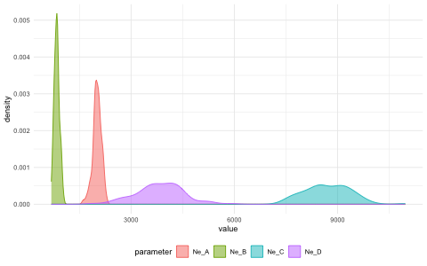
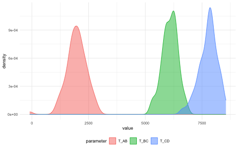
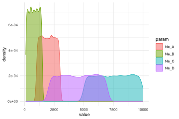

<!-- README.md is generated from README.Rmd. Please edit that file -->


# _demografr_: Simulation-based inference for population genetics

<!-- badges: start -->

<!--[](https://cran.r-project.org/package=slendr) [](https://cran.r-project.org/package=slendr) -->

[](https://github.com/bodkan/demografr/actions) [](http://beta.mybinder.org/v2/gh/bodkan/demografr/main?urlpath=rstudio) [](https://app.codecov.io/github/bodkan/demografr?branch=main)

<!-- badges: end -->


⚠️⚠️⚠️

**Please note that _demografr_ is still under active development. As a result, the interface (names of functions, names of function arguments, but even the functionality in general) does change on rather short notice and quite unpredictably. Before there is a first release of the R package on CRAN (and an associated preprint with it), you shouldn't be using _demografr_ for your work. If you'd like to be notified of updates and releases, click on on "Watch" on top of the main GitHub page. Thanks for understanding!**

⚠️⚠️⚠️

The goal of _demografr_ is to simplify and streamline the development of simulation-based inference pipelines in population genetics, such as [Approximate Bayesian Computation](https://en.wikipedia.org/wiki/Approximate_Bayesian_computation) (ABC) or parameter grid inferences, and make them more reproducible. _demografr_ also aims to make the inferences orders of magnitude faster and more efficient by leveraging the [tree sequences](https://tskit.dev/learn/) as an internal data structure and computation engine.

Unlike traditional ABC and other simulation-based approaches, which generally involve custom-built pipelines and scripts for population genetic simulation and computation of summary statistics, _demografr_ makes it possible to perform simulation, data analysis, and the inference itself entirely in R within a single reproducible analysis script. By eliminating the need to write custom simulation code and scripting for integration of various population genetic tools for computing summary statistics, it lowers the barrier to entry for new users and facilitates reproducibility for all users regardless of their level of experience by eliminating many common sources of bugs.

### How does _demografr_ help with ABC?

_demografr_ streamlines every step of a typical ABC pipeline by leveraging the [_slendr_](https://github.com/bodkan/slendr/) framework as a building block for simulation and data analysis, making it possible to write complete ABC workflows in R. Specifically:

1. _slendr_'s intuitive, interactive [interface for definning population genetic models](https://www.slendr.net/articles/vignette-04-nonspatial-models.html) makes it easy to encode even complex demographic models with only bare minimum of R knowledge needed.
2. _demografr_ makes it possible to encode prior distributions of parameters using familiar R interface resembling standard probabilistic statements, and provides an automated function which simulates ABC replicates drawing parameters from priors in a trivial, one-step manner.
3. Because _slendr_'s simulation output is a [tree sequence](https://tskit.dev/learn/), most population genetic statistics can be computed directly on such tree sequences using R functions which are part of _slendr_'s statistical library. A tree sequence is never saved to disk and no conversion between file formats is required.
4. _demografr_ facilitates tight integration with the powerful R package [_abc_](https://cran.r-project.org/package=abc) by automatically feeding its simulation data to the _abc_ package for inference and analysis.

## Installation

You can install the development version of _demografr_ from [GitHub](https://github.com/) with:

``` r
devtools::install_github("bodkan/demografr")
```

Note that this requires an R package _devtools_, which you can obtain simply by running `install.packages("devtools")`.

Because _demografr_ is tightly linked to the _slendr_ simulation package (in fact, new developments
in _slendr_ ale currently driven by requirements of _demografr_), you will also need the
development version of _slendr_ itself:

``` r
devtools::install_github("bodkan/slendr")
```

### Note on stability

_demografr_ is very much in an experimental stage at this point. Although ABC fitting of "standard" demographic models (i.e. estimating $N_e$, split times and gene-flow parameters for non-spatial models) already works very nicely, our long-term ambitions for the project are much higher and extend, for instance, towards inferences of spatial models. As such, please be aware that the interface might change on a rather short notice to accomodate features for estimating parameters of much more complex custom models.

If you want to follow updates on _demografr_, you can do this also on my [Mastodon](https://fosstodon.org/@bodkan) and by checking out the [changelog](https://bodkan.net/demografr/news/) from time to time.


### Testing the R package in an online RStudio session

You can open an RStudio session and test examples from the [vignettes](https://bodkan.net/demografr/articles/) directly in your web browser by clicking this button (no installation is needed!):

[](http://beta.mybinder.org/v2/gh/bodkan/demografr/main?urlpath=rstudio)

**In case the RStudio instance appears to be starting very slowly, please be patient (Binder is a freely available service with limited computational resources provided by the community).** If Binder crashes, try reloading the web page, which will restart the cloud session.

Once you get a browser-based RStudio session, you can navigate to the `vignettes/` directory and test the examples on your own!

## Important pieces missing so far

Tying the results of _demografr_ ABC inference (internally facilitated by the _abc_ package) to various diagnostics features of _abc_ and other tools.

## An example ABC analysis

Imagine that we sequenced genomes of individuals from populations "popA", "popB", "popC", and "popD".

Let's also assume that we know that the three populations are phylogenetically related in the following way with an indicated gene-flow event at a certain time in the past, but we don't know anything else (i.e., we have no idea about their $N_e$ or split times):


After sequencing the genomes of individuals from these populations, we computed the nucleotide diversity in these populations as well as their pairwise genetic divergence, and observed the following values which we saved in two standard R data frames:

1. Nucleotide diversity in each population:


```r
observed_diversity <- read.table(system.file("examples/basics_diversity.tsv", package = "demografr"), header = TRUE)

observed_diversity
#>    set    diversity
#> 1 popA 8.037847e-05
#> 2 popB 3.242467e-05
#> 3 popC 1.021123e-04
#> 4 popD 8.968777e-05
```

2. Pairwise divergence d_X_Y between populations X and Y:


```r
observed_divergence <- read.table(system.file("examples/basics_divergence.tsv", package = "demografr"), header = TRUE)

observed_divergence
#>      x    y   divergence
#> 1 popA popB 0.0002387594
#> 2 popA popC 0.0002391843
#> 3 popA popD 0.0002389617
#> 4 popB popC 0.0001089125
#> 5 popB popD 0.0001155571
#> 6 popC popD 0.0001105323
```

3. Value of the following $f_4$-statistic:


```r
observed_f4  <- read.table(system.file("examples/basics_f4.tsv", package = "demografr"), header = TRUE)

observed_f4
#>      W    X    Y    Z            f4
#> 1 popA popB popC popD -3.433205e-06
#> 2 popA popC popB popD -7.125812e-07
#> 3 popA popD popB popC  2.720624e-06
```

### A complete ABC analysis in a single R script

This is how we would use _demografr_ to estimate the $N_e$ and split times for all populations (and the rate of the indicated gene-flow event) with Approximate Bayesian Computation in a single R script:


```r
library(demografr)
library(slendr)

# set up the internal tskit/msprime environment
init_env()

# set up parallelization across all CPUs on the current machine
library(future)
plan(multisession, workers = availableCores())

#--------------------------------------------------------------------------------
# bind data frames with empirical summary statistics into a named list
observed <- list(
  diversity  = observed_diversity,
  divergence = observed_divergence,
  f4         = observed_f4
)

#--------------------------------------------------------------------------------
# define a model generating function using the slendr interface
# (each of the function parameters correspond to a parameter we want to infer)

model <- function(Ne_A, Ne_B, Ne_C, Ne_D, T_AB, T_BC, T_CD, gf_BC) {
  # define populations
  popA <- population("popA", time = 1,    N = Ne_A)
  popB <- population("popB", time = T_AB, N = Ne_B, parent = popA)
  popC <- population("popC", time = T_BC, N = Ne_C, parent = popB)
  popD <- population("popD", time = T_CD, N = Ne_D, parent = popC)

  # define gene-flow events
  gf <- gene_flow(from = popB, to = popC, start = 9000, end = 9301, rate = gf_BC)

  # compile a slendr model
  model <- compile_model(
    populations = list(popA, popB, popC, popD), gene_flow = gf,
    generation_time = 1, simulation_length = 10000,
    direction = "forward", serialize = FALSE
  )

  # set up sampling schedule (2 diploid individuals from each population at
  # the end of the simulation) -- this step is optional
  samples <- schedule_sampling(
    model, times = 10000,
    list(popA, 2), list(popB, 2), list(popC, 2), list(popD, 2),
    strict = TRUE
  )

  # a return statement is mandatory!
  # if a sampling schedule is not generated, use return(model)
  return(list(model, samples))
}

#--------------------------------------------------------------------------------
# setup priors for model parameters

priors <- list(
  Ne_A ~ runif(1, 10000),
  Ne_B ~ runif(1, 10000),
  Ne_C ~ runif(1, 10000),
  Ne_D ~ runif(1, 10000),

  T_AB ~ runif(1, 10000),
  T_BC ~ runif(1, 10000),
  T_CD ~ runif(1, 10000),

  gf_BC ~ runif(0, 1)
)

#--------------------------------------------------------------------------------
# define summary functions to be computed on simulated data (must be of the
# same format as the summary statistics computed on empirical data)

compute_diversity <- function(ts) {
  samples <- ts_names(ts, split = "pop")
  ts_diversity(ts, sample_sets = samples)
}
compute_divergence <- function(ts) {
  samples <- ts_names(ts, split = "pop")
  ts_divergence(ts, sample_sets = samples)
}
compute_f4 <- function(ts) {
  samples <- ts_names(ts, split = "pop")
  A <- samples["popA"]; B <- samples["popB"]
  C <- samples["popC"]; D <- samples["popD"]
  rbind(
    ts_f4(ts, A, B, C, D),
    ts_f4(ts, A, C, B, D),
    ts_f4(ts, A, D, B, C)
  )
}

# the summary functions must be also bound to an R list named in the same
# way as the empirical summary statistics
functions <- list(
  diversity  = compute_diversity,
  divergence = compute_divergence,
  f4         = compute_f4
)

#--------------------------------------------------------------------------------
# validate the individual ABC components for correctness and consistency
validate_abc(model, priors, functions, observed)

#--------------------------------------------------------------------------------
# run ABC simulations
data <- simulate_abc(
  model, priors, functions, observed, iterations = 10000,
  sequence_length = 50e6, recombination_rate = 1e-8, mutation_rate = 1e-8
)

#--------------------------------------------------------------------------------
# infer posterior distributions of parameters using the abc R package
abc <- run_abc(data, engine = "abc", tol = 0.01, method = "neuralnet")
```


## Analysing posterior distributions of parameters

After we run this R script, we end up with an object called `abc` here. This object contains the complete information about the results of our inference. In particular, it carries the posterior samples for our parameters of interest ($N_e$ of populations and their split times).

For instance, we can get a table of all posterior values with the function `extract_summary()`:


```r
extract_summary(abc)
#>                             Ne_A      Ne_B      Ne_C      Ne_D     T_AB
#> Min.:                   804.0797  408.1848 -4305.207  502.5387 1607.479
#> Weighted 2.5 % Perc.:   902.1518  457.8242  6383.142 2259.9200 1665.661
#> Weighted Median:       2015.7613 1000.0325  8405.996 3714.8076 2010.293
#> Weighted Mean:         1997.8872  958.8280  8516.165 3852.1225 2016.526
#> Weighted Mode:         2195.5323 1067.1600  8619.141 3564.2851 1995.493
#> Weighted 97.5 % Perc.: 3434.1764 1563.1426 11309.784 6598.2645 2262.405
#> Max.:                  3646.4941 1919.2377 11815.139 6641.5602 2450.616
#>                            T_BC     T_CD       gf_BC
#> Min.:                  4843.964 7228.372 -0.21801869
#> Weighted 2.5 % Perc.:  4908.179 7286.378 -0.04095791
#> Weighted Median:       5936.615 7874.670  0.11279850
#> Weighted Mean:         5909.206 7907.132  0.11161160
#> Weighted Mode:         5832.770 7724.623  0.07205975
#> Weighted 97.5 % Perc.: 6651.473 8734.573  0.26094451
#> Max.:                  6793.562 9936.191  1.41335586
```

We can also specify a subset of model parameters to select, or provide a regular expression for this subsetting:


```r
extract_summary(abc, param = "Ne")
#>                             Ne_A      Ne_B      Ne_C      Ne_D
#> Min.:                   804.0797  408.1848 -4305.207  502.5387
#> Weighted 2.5 % Perc.:   902.1518  457.8242  6383.142 2259.9200
#> Weighted Median:       2015.7613 1000.0325  8405.996 3714.8076
#> Weighted Mean:         1997.8872  958.8280  8516.165 3852.1225
#> Weighted Mode:         2195.5323 1067.1600  8619.141 3564.2851
#> Weighted 97.5 % Perc.: 3434.1764 1563.1426 11309.784 6598.2645
#> Max.:                  3646.4941 1919.2377 11815.139 6641.5602
```

We can also visualize the posterior distributions. Rather than plotting many different distributions at once, let's first check out the posterior distributions of inferred $N_e$ values:


```r
plot_posterior(abc, param = "Ne")
```



Similarly, we can take a look at the inferred posteriors of the split times:


```r
plot_posterior(abc, param = "T")
```



And, finally, the rate of gene flow:


```r
plot_posterior(abc, param = "gf") + ggplot2::coord_cartesian(xlim = c(0, 1))
```


Finally, we have the diagnostic functionality of the [_abc_](https://cran.r-project.org/package=abc) R package at our disposal:


```r
plot(abc, param = "Ne_C")
```


## Additional functionality

_demografr_ also provides a couple of functions designed to make troubleshooting a little easier.

For instance, assuming we have `priors` set up as above, we can visualize the prior distribution(s) like this:


```r
plot_prior(priors, "Ne")
```




```r
plot_prior(priors, c("^T", "^gf"), facet = TRUE)
```


