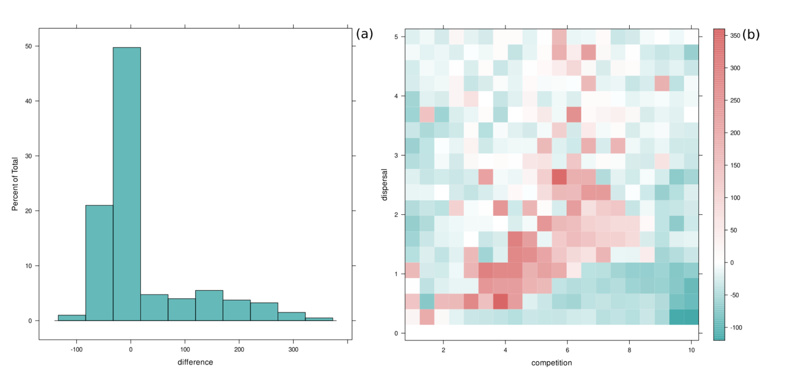

```{r, include = FALSE}
knitr::opts_chunk$set(
  collapse = FALSE,
  comment = "#>",
  fig.width = 8,
  fig.height = 5,
  dpi = 100
)

devtools::install()
```

**ABC is not the only useful application for massive, lightning-fast tree-sequence based simulation inference!**

## Use-cases

### Neanderthal ancestry "decline"

**Fu et al. (2016):**


**me et al. (2018):**


### Fancier grid simulations

**Emma Prantoni's BSC thesis -- differences of census size and Ne given different ecological parameters:**



## Idea: use demografr also for automated parameter grid simulations

**Because the reason demografr's is useful for ABC applies to all other means of simulation-based inference!**

```{r, echo=FALSE, message=FALSE}
library(demografr)
library(slendr)
init_env()

library(dplyr)
library(tidyr)
library(ggplot2)

# setup parallelization across all CPUs
library(future)
plan(multicore, workers = availableCores())
```

### 1. Define a _slendr_ model function capturing the demographic history

```{r, echo=FALSE}
model <- function(rate_ea, rate_aa, rate_ae) {
  # create populations
  chimp <- population("chimp", time = 7e6,   N = 10000)
  anc   <- population("anc",   time = 6e6,   N = 10000, parent = chimp)
  nea   <- population("nea",   time = 600e3, N = 2000,  parent = anc)
  afr1  <- population("afr1",  time = 600e3, N = 15000, parent = anc)
  afr2  <- population("afr2",  time = 150e3, N = 15000, parent = afr1)
  eur   <- population("eur",   time = 75e3,  N = 5000,  parent = afr2)

  # specify gene-flow events
  gf <- list(
    # Neanderthal introgression
    gene_flow(from = nea, to = eur, start = 60e3, end = 50e3, rate = 0.03),
    # back flow from Eurasia into Africa
    gene_flow(from = eur, to = afr1, start = 5e3, end = 0, rate = rate_ea),
    gene_flow(from = eur, to = afr2, start = 5e3, end = 0, rate = rate_ea),
    # gene flow within Africa
    gene_flow(from = afr1, to = afr2, start = 50e3, end = 0, rate = rate_aa),
    gene_flow(from = afr2, to = afr1, start = 50e3, end = 0, rate = rate_aa),
    # gene flow from Africa into Eurasia ('dilution' of Neanderthal ancestry)
    gene_flow(from = afr1, to = eur, start = 5e3, end = 0, rate = rate_ae),
    gene_flow(from = afr2, to = eur, start = 5e3, end = 0, rate = rate_ae)
  )

  # generate a slendr model
  model <- compile_model(
    populations = list(chimp, anc, nea, afr1, afr2, eur), gene_flow = gf,
    generation_time = 30, serialize = FALSE
  )

  # specify sampling events
  samples <- rbind(
    # Altai (70 kya) and Vindija (40 kya) Neanderthals
    schedule_sampling(model, times = c(70e3, 40e3), list(nea, 1)),
    # Europeans from 40 kya to the present
    schedule_sampling(model, times = seq(40000, 0, -2000), list(eur, 1)),
    # two African populations
    schedule_sampling(model, times = 0, list(afr1, 1), list(afr2, 1)),
    # Chimpanzee outgroup
    schedule_sampling(model, times = 0, list(chimp, 1))
  )

  return(list(model, samples))
}
```

```{r, echo=FALSE}
m <- model(0.1, 0.1, 0.1)[[1]]
cowplot::plot_grid(plot_model(m, gene_flow = FALSE), plot_model(m, log = TRUE, gene_flow = FALSE))
```

### 2. Define summary statistics

```{r}
# "direct" f4-ratio statistic
direct <- function(ts) {
  ts_f4ratio(ts, X = paste0("eur_", 1:21),
             A = "nea_2", B = "nea_1", C = "afr1_1", O = "chimp_1")
}

# "indirect" f4-ratio statistic
indirect <- function(ts) {
  ts_f4ratio(ts, X = paste0("eur_", 1:21),
             A = "afr1_1", B = "afr2_1", C = "nea_2", O = "chimp_1")
}

functions <- list(direct = direct, indirect = indirect)
```

### 3. Define a parameter grid

One column for each parameter of the _slendr_ model function (names must match!).

```{r}
grid <- crossing(
  rate_aa = seq(0, 0.25, 0.025),
  rate_ea = seq(0, 0.25, 0.025),
  rate_ae = seq(0, 0.25, 0.025)
)

head(grid)
```

### 4. Run parallel grid simulation replicates, automatically computing tree-sequence summary statistics

`simulate_grid()` is a new function in _demografr_.

```{r, eval=!file.exists(here::here("grid_results.rds"))}
results <- simulate_grid(
  model, grid, functions, replicates = 5,
  sequence_length = 0.1e6, mutation_rate = 1e-8, recombination_rate = 1e-8
)
```

```{r, eval=!file.exists(here::here("grid_results.rds")), echo=FALSE}
saveRDS(results, "grid_results.rds")
```

```{r, eval=file.exists(here::here("grid_results.rds")), echo=FALSE}
results <- readRDS(here::here("grid_results.rds"))
```

### 5. Analyze data

```{r}
print(results, n = 20)
```

For conciseness, computer tree-sequence summary statistics are stored along the original parameter grid as so-called ["list columns"](https://dcl-prog.stanford.edu/list-columns.html):

```{r}
results$direct_f4ratio[1:2]
```

They are efficient and concise, but in order to be able to analyze data stored in them, we need a function `unnest()` from _tidyverse_, which "explodes" a list-column with stored data frames into a wider data frame which can be immediately analyzed:

**Direct f4-ratio:**

```{r}
results %>% unnest(direct_f4ratio)
```

**Indirect f4-ratio:**

```{r}
results %>% unnest(indirect_f4ratio)
```

For downstream analysis, we can then use all the _tidyverse_ functionality at our disposal:

```{r}
samples <- tibble(
  X = paste0("eur_", 1:21),
  time = seq(40000, 0, -2000)
)
```
### Within-African gene flow vs inference of Neanderthal ancestry

```{r}
results %>%
  unnest(indirect) %>%
  filter(rate_ea == 0, rate_ae == 0) %>%
  inner_join(samples, by = "X") %>%
  ggplot(aes(time, 1 - alpha, color = rate_aa, group = rate_aa)) +
    geom_line(stat = "smooth", se = FALSE) +
    geom_hline(yintercept = 0.03, color = "red", linetype = "dashed") +
    geom_hline(yintercept = 0, color = "black", linetype = "dashed") +
    labs(x = "years before present", y = "Neanderthal ancestry proportion") +
    xlim(40000, 0) +
    coord_cartesian(y = c(0, 0.1)) +
    ggtitle("The effect of within-Africa gene flow (afr1 <-> afr2) on 'direct f4-ratio'",
            "Red line indicates the true Neanderthal ancestry proportion")
```

```{r}
results %>%
  unnest(direct) %>%
  filter(rate_ea == 0, rate_ae == 0) %>%
  inner_join(samples, by = "X") %>%
  ggplot(aes(time, alpha, color = rate_aa, group = rate_aa)) +
    geom_line(stat = "smooth", se = FALSE) +
    geom_hline(yintercept = 0.03, color = "red", linetype = "dashed") +
    geom_hline(yintercept = 0, color = "black", linetype = "dashed") +
    labs(x = "years before present", y = "Neanderthal ancestry proportion") +
    xlim(40000, 0) +
    coord_cartesian(y = c(0, 0.1)) +
    ggtitle("The effect of within-Africa gene flow (afr1 <-> afr2) on 'direct f4-ratio'",
            "Red line indicates the true Neanderthal ancestry proportion")
```

### Eurasia -> Africa gene flow vs inference of Neanderthal ancestry
<!--
```{r}
results %>%
  unnest(indirect) %>%
  filter(rate_aa == 0, rate_ae == 0) %>%
  inner_join(samples, by = "X") %>%
  ggplot(aes(time, alpha, color = rate_ea, group = rate_ea)) +
    geom_line(stat = "smooth", se = FALSE) +
    geom_hline(yintercept = 0.03, color = "red", linetype = "dashed") +
    geom_hline(yintercept = 0, color = "black", linetype = "dashed") +
    labs(x = "years before present", y = "Neanderthal ancestry proportion") +
    xlim(40000, 0) +
    coord_cartesian(y = c(-0.05, 0.1)) +
    ggtitle("The effect of Eurasia -> Africa gene flow on 'indirect f4-ratio'",
            "Red line indicates the true Neanderthal ancestry proportion")
```

```{r}
results %>%
  unnest(direct) %>%
  filter(rate_aa == 0, rate_ae == 0) %>%
  inner_join(samples, by = "X") %>%
  ggplot(aes(time, alpha, color = rate_ea, group = rate_ea)) +
    geom_line(stat = "smooth", se = FALSE) +
    geom_hline(yintercept = 0.03, color = "red", linetype = "dashed") +
    geom_hline(yintercept = 0, color = "black", linetype = "dashed") +
    labs(x = "years before present", y = "Neanderthal ancestry proportion") +
    xlim(40000, 0) +
    coord_cartesian(y = c(0, 0.1)) +
    ggtitle("The effect of Eurasia -> Africa gene flow on 'direct f4-ratio'",
            "Red line indicates the true Neanderthal ancestry proportion")
```
 -->

```{r}
results %>%
  unnest(indirect) %>%
  filter(rate_aa == 0.2, rate_ae == 0) %>%
  inner_join(samples, by = "X") %>%
  ggplot(aes(time, 1 - alpha, color = rate_ea, group = rate_ea)) +
    geom_line(stat = "smooth", se = FALSE) +
    geom_hline(yintercept = 0.03, color = "red", linetype = "dashed") +
    geom_hline(yintercept = 0, color = "black", linetype = "dashed") +
    labs(x = "years before present", y = "Neanderthal ancestry proportion") +
    xlim(40000, 0) +
    coord_cartesian(y = c(0, 0.1)) +
    ggtitle("The effect of Eurasia -> Africa gene flow on 'direct f4-ratio'",
            "Red line indicates the true Neanderthal ancestry proportion")
```


```{r}
results %>%
  unnest(direct) %>%
  filter(rate_aa == 0.2, rate_ae == 0) %>%
  inner_join(samples, by = "X") %>%
  ggplot(aes(time, alpha, color = rate_ea, group = rate_ea)) +
    geom_line(stat = "smooth", se = FALSE) +
    geom_hline(yintercept = 0.03, color = "red", linetype = "dashed") +
    geom_hline(yintercept = 0, color = "black", linetype = "dashed") +
    labs(x = "years before present", y = "Neanderthal ancestry proportion") +
    xlim(40000, 0) +
    coord_cartesian(y = c(0, 0.1)) +
    ggtitle("The effect of Eurasia -> Africa gene flow on 'direct f4-ratio'",
            "Red line indicates the true Neanderthal ancestry proportion")
```

**me et al. (2018):**

