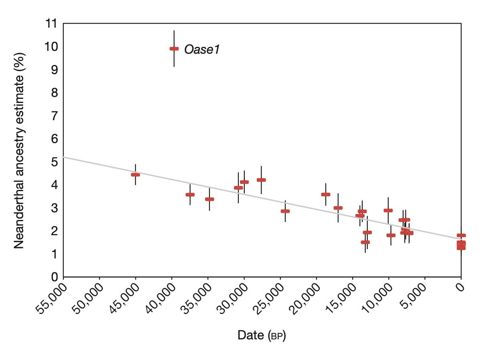
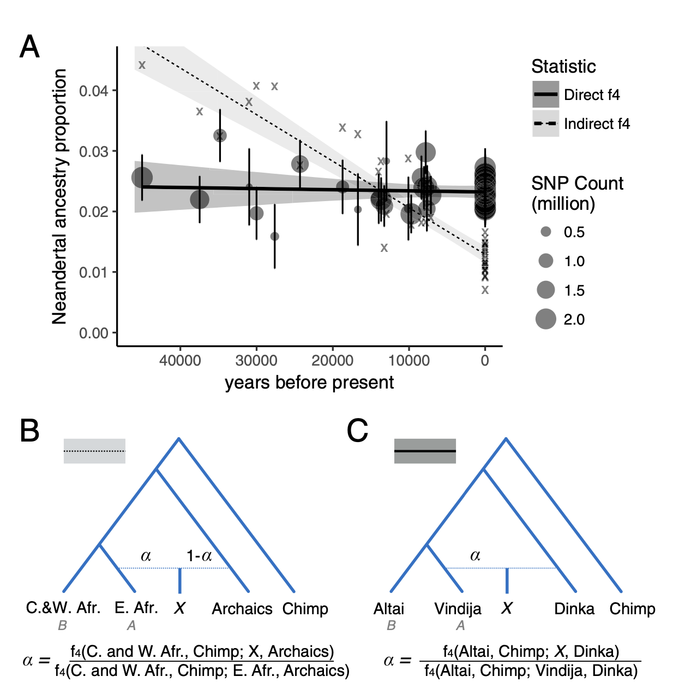
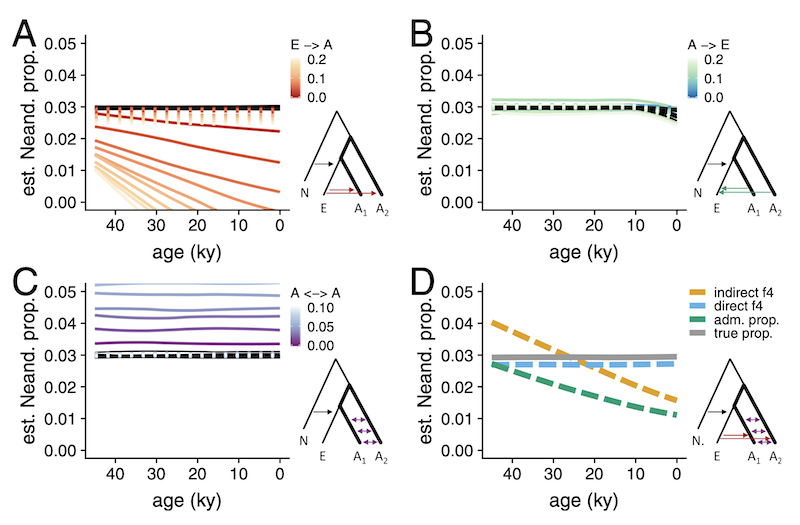

```{r, include = FALSE}
slendr_present <- slendr::check_dependencies(python = TRUE)

knitr::opts_chunk$set(
  collapse = FALSE,
  comment = "#>",
  fig.align = "center",
  fig.width = 8,
  fig.height = 5,
  dpi = 80,
  eval = slendr_present
)

data_path <- here::here("inst/examples/grid_data.rds")
```

⚠️⚠️⚠️

**The _demografr_ R package is still under active development!**

⚠️⚠️⚠️

Although Approximate Bayesian Computation is arguably the most popular method
for simulation-based inference, it's certainly not the only one. Another useful
technique for exploring the behavior of statistics under given combination of
model parameters, and perhaps even very simple model fitting are grid
simulations. Briefly, we define a set of parameters of a model, run simulation
replicates for each combination of parameters, computing summary statistics of
interest for each replicate, and then&mdash;for instance&mdash;inspect which
parameter combinations lead to the values of summary statistics closes to those
we observed in the data, or simply inspect how do different parameter values
affect the statistics in general.

## Example analysis

To demonstrate the features of _demografr_ for grid-based simulation inference,
let's try to reproduce the result from Petr _et al._ (PNAS 2018). Briefly,
this paper made an attempt to explain discrepancies between two different ways
to estimate the proportion of Neanderthal ancestry in Europe over tens of
thousands of years.

1. The first statistic (dubbed the "indirect $f_4$-ratio" statistic) showed the
following pattern of Neanderthal ancestry significantly declining over time
(figure from [Fu _et al._, Nature 2016](https://www.nature.com/articles/nature17993))

{width="80%"}

2. An alternative statistic (called "direct $f_4$-ratio" statistic, shown
in the figure below in solid line in contrast to the "indirect $f_4$-statistic"
as dashed line) did not find any significant decline at all as shown in this
figure from Petr _et al._ (PNAS 2018).

{width="80%"}

**The question was, why are these two measures of Neanderthal ancestry leading
to different conclusions?** Could some violations of their assumptions (such as
an unaccounted-for gene-flow events between modern human populations) break
one of them?

The way the PNAS 2018 study approached the problem was to run many simulation
replicates across a large parameter grid. This required writing custom
coalescent simulations, orchestrating running them across the parameter grid,
collecting the genotypes the simulations produced, and computing population
genetic statistics (here direct and indirect $f_4$-ratios)&mdash;all in all,
a couple of hundred lines of Python, R, and bash.

This vignette shows how to use _demografr_ to perform these kind of workflows
in a much more straightforward and reproducible manner, entirely in R.

## Grid simulation with _demografr_

```{r, echo=FALSE, message=FALSE}
library(demografr)
library(slendr)
init_env()

library(dplyr)
library(tidyr)
library(ggplot2)
library(cowplot)

# setup parallelization across all CPUs
library(future)
plan(multisession, workers = availableCores())
```

### 1. Define a _slendr_ model function capturing the demographic history

As in any standard ABC pipeline using _demografr_, we leverage the _slendr_ R
package to first define a demografic model, encoding it as a simple R function.
Again, as with standard ABC, **the arguments of this function correspond to
model parameters**. Note that those will come from the parameter grid, not via
sampling from priors as with ABC.

In our example, because the research question of interest involved various
gene-flow rates between populations in the model, we fix split times and $N_e$
values because they are not that interesting or important for this simple
inference workflow (we ignore the Eurasia to Africa "backflow" for the same
reason):

```{r}
model <- function(rate_ea, rate_aa) {
  # create populations
  chimp <- population("chimp", time = 7e6,   N = 10000)
  anc   <- population("anc",   time = 6e6,   N = 10000, parent = chimp)
  nea   <- population("nea",   time = 600e3, N = 2000,  parent = anc)
  afr1  <- population("afr1",  time = 600e3, N = 15000, parent = anc)
  afr2  <- population("afr2",  time = 150e3, N = 15000, parent = afr1)
  eur   <- population("eur",   time = 75e3,  N = 5000,  parent = afr2)

  # define gene-flow events
  gf <- list(
    # back flow from Eurasia into Africa -- one parameter of interest
    gene_flow(from = eur, to = afr1, start = 5e3, end = 0, rate = rate_ea),
    gene_flow(from = eur, to = afr2, start = 5e3, end = 0, rate = rate_ea),

    # gene flow within Africa -- another parameter of interest
    gene_flow(from = afr1, to = afr2, start = 50e3, end = 0, rate = rate_aa),
    gene_flow(from = afr2, to = afr1, start = 50e3, end = 0, rate = rate_aa),

    # Neanderthal introgression (fixed to 3%)
    gene_flow(from = nea, to = eur, start = 60e3, end = 50e3, rate = 0.03)
  )

  # generate a slendr model
  model <- compile_model(
    populations = list(chimp, anc, nea, afr1, afr2, eur), gene_flow = gf,
    generation_time = 30, serialize = FALSE
  )

  # specify sampling events
  samples <- rbind(
    # Altai (70 kya) and Vindija (40 kya) Neanderthals
    schedule_sampling(model, times = c(70e3, 40e3), list(nea, 1)),
    # Europeans from 40 kya to the present
    schedule_sampling(model, times = seq(40000, 0, -2000), list(eur, 1)),
    # two African populations
    schedule_sampling(model, times = 0, list(afr1, 1), list(afr2, 1)),
    # Chimpanzee outgroup
    schedule_sampling(model, times = 0, list(chimp, 1))
  )

  return(list(model, samples))
}
```

Let's check the model function by visualizing it (we set the gene-flow rates
to arbitrary values, because this is purely a visualization test):

```{r, plot_model}
test_model <- model(rate_ea = 0.42, rate_aa = 0.42)[[1]]

plot_grid(
  plot_model(test_model, gene_flow = FALSE),
  plot_model(test_model, log = TRUE, gene_flow = TRUE)
)
```

The model looks OK, so in the next step we define summary statistics
statistics we are interested in (again, just as we would for an ABC pipeline).

### 2. Define summary statistics

Recall that we want to explore the impact of modern-human gene flow on
Neanderthal ancestry as inferred using two ways of computing it: "indirect"
and "direct" $f_4$-ratio statistics.

Because our model samples `r length(seq(40000, 0, -2000))` European individuals
across the last 40 thousand years, we will compute the $f_4$-ratio statistics
on all of these individuals in sequence.

_demografr_ uses the R package _slendr_ not just for encoding demographic
models and popgen simulations, but also for tree-sequences computation via its
interface to the powerful library
[_tskit_](https://tskit.dev/tskit/docs/stable/introduction.html).
One advantage of _slendr_ is that it allows referring to simulated samples via
their "symbolic names". This means that, for instance, the first individual
sampled from a population "eur" is named "eur_1", the second is named as
"eur_2", etc. Therefore, we can capture the names of every European individual
in a vector `X` by running:

```{r}
X <- paste0("eur_", 1:21)
X
```

and use this vector in any tree-sequence function of _slendr_/_tskit_.
Specifically, we can define the "indirect" and "direct" $f_4$-ratio statistics
in this way (using the equations defined in the figure above):

```{r}
# compute the "indirect" f4-ratio statistic via slendr/tskit function ts_f4ratio,
# returning its data frame output as it is
indirect <- function(ts) {
  X <- paste0("eur_", 1:21)
  ts_f4ratio(ts, X = X, A = "afr1_1", B = "afr2_1", C = "nea_2", O = "chimp_1")
}

# compute the "direct" f4-ratio statistic via slendr/tskit function ts_f4ratio,
# returning its data frame output as it is
direct <- function(ts) {
  X <- paste0("eur_", 1:21)
  ts_f4ratio(ts, X = X, A = "nea_2", B = "nea_1", C = "afr1_1", O = "chimp_1")
}
```

Exactly as it's the case for ABC, for the purposes of grid-based simulations we
have to define functions which will be used to compute summary statistics whose
behavior across a parameter grid we want to investigate:

```{r}
# bind both functions in a named list
functions <- list(direct = direct, indirect = indirect)
```

This looks quite neat and tidy, but how can we make sure that our tree-sequence
summary functions really work? We need a simulated tree-sequence object first!
_demografr_ provides an easy way to get an arbitrary tree sequence from a model
function via its helper function `simulate_model`. The simples way to use it
is like this:

```{r}
# we don't care about the parameter values, as we only want to get a tree sequence
# (also, note we did not specify sequence length, recombination rate, etc.)
ts <- simulate_model(
  model, parameters = list(rate_ea = 0.1, rate_aa = 0.15),
  sequence_length = 1e6, recombination_rate = 1e-8, mutation_rate = 1e-8
)
```

With the tiny tree sequence for testing, we can now check if our tree-sequence
functions work as they're supposed to:

```{r}
functions$direct(ts)

functions$indirect(ts)
```

Excellent, we get the output tables from `ts_f4ratio` functions as we're
supposed to (and get one estimate for each of the
`r length(seq(40000, 0, -2000))`):

```{r}
functions$direct(ts) %>% nrow

functions$indirect(ts) %>% nrow
```

### 3. Define a parameter grid

Finally (and yet again, analogously to an equivalent ABC pipeline) we define
parameters to simulate over. Specifically, for a grid simulation, we define a
data frame with one column for each parameter of the _slendr_ model function
(the names of parameter columns must match the model function arguments!).
For this purpose, the function `crossing` from the _tidyr_ R package is
particularly helpful, so let's use it here:

```{r}
library(tidyr)

grid <- crossing(
  rate_aa = seq(0, 0.25, 0.025),
  rate_ea = seq(0, 0.25, 0.025)
)

head(grid)
```

In this way, we defined `r nrow(grid)` parameter combinations and can finally
proceed to the simulation inference.

### 4. Perform grid-based simulations, compute summary statistics for each

In a final analogy to the ABC inference with _demografr_, we have a function
`simulate_grid()` which works a little similarly to `simulate_abc()` introduced
[in the first vignette](https://bodkan.net/demografr/articles/vignette-01-basics.html).
In fact, the function has a nearly identical interface&mdash;we plug in the
model function, our parameter grid, the list of summary tree-sequence
functions, the number of simulation replicates to perform for each parameter
combination (and a few other obvious parameters shown here).

First, we will set up an automated parallelization scheme using the [_future_](https://cran.r-project.org/package=future) R package:

```{r}
library(future)

# parallelize simulations across all CPUs of the machine
plan(multisession, workers = availableCores())
```

(See much more detail on parallelization of _demografr_ inference pipelines in
[this vignette](vignette-04-parallelization.html)).

```{r, echo=FALSE, eval=TRUE}
tstart <- Sys.time()
```

```{r, eval=!file.exists(data_path)}
results <- simulate_grid(
  model, grid, functions, replicates = 50,
  sequence_length = 25e6, mutation_rate = 1e-8, recombination_rate = 1e-8
)
```

```{r, echo=FALSE, eval=TRUE}
tend <- Sys.time()
tdelta <- as.numeric(difftime(tend, tstart, units = "secs"))
ncores <- future::availableCores()
```

```{r, echo=FALSE, eval=!file.exists(data_path)}
saveRDS(tdelta, here::here("inst/examples/grid_tdelta.rds"))
saveRDS(ncores, here::here("inst/examples/grid_ncores.rds"))
```

```{r, echo=FALSE, eval=file.exists(data_path)}
tdelta <- readRDS(here::here("inst/examples/grid_tdelta.rds"))
ncores <- readRDS(here::here("inst/examples/grid_ncores.rds"))
```

```{r, echo=FALSE, eval=TRUE}
hours <- floor(tdelta / 3600)
minutes <- floor((tdelta - hours * 3600) / 60)
seconds <- round(tdelta - hours * 3600 - minutes * 60)
```

**The total runtime for the grid simulations was
`r paste(hours, "hours", minutes, "minutes", seconds, "seconds")`
parallelized across `r ncores` CPUs.**

```{r, eval=!file.exists(data_path), echo=FALSE}
saveRDS(results, data_path)
```

```{r, eval=file.exists(data_path), echo=FALSE}
results <- readRDS(data_path)
```

### 5. Examine results

The function `simulate_grid()` returns all results in a data frame object in
the following format:

```{r}
print(results, n = 10)
```

The first column indicates a replicate number, the following few columns are
the values of the parameter grid. Most important are the last columns, though,
each named after a single summary statistics (i.e., their symbolic names are
taken from the named-list of summary functions above). For conciseness,
the values of these summary
statistics are stored as so-called
["list columns"](https://dcl-prog.stanford.edu/list-columns.html)&mdash;
for each
replicate and each parameter combination, these columns store the summary
statistics as "nested" data frames. For instance, here are the results for
the "direct" $f_4-ratio$ statistic across the first three simulation runs.
You can see that the list-column `"direct"` contains a list of data frames,
one data frame for each simulation replicate:

```{r}
results$direct[1:3]
```

List columns are very efficient and concise for storing complex data like this,
but in order to be able to analyze data stored in them, we need a function 
[`unnest()`](https://tidyr.tidyverse.org/reference/unnest.html) from
_tidyverse_, which "unpacks" a list-column with stored data frames into a
wider data frame which stores the actual values of a given statistic as normal
numerical column. In this example:

**Direct f4-ratio:**

```{r}
results %>% unnest(direct)
```

**Indirect f4-ratio:**

```{r}
results %>% unnest(indirect)
```

Because we are interested in the behavior of trajectories of indirect and
direct estimates of Neanderthal ancestry over time assuming different values
of some demographic parameters, we will first create a small data frame
indicating the times of sampling of each simulated European
individual. We will use this small data frame for join operations for the
purpose of plotting below:

```{r}
samples <- tibble(
  X = paste0("eur_", 1:21),
  time = seq(40000, 0, -2000)
)
```

### Within-African gene flow vs inference of Neanderthal ancestry

Let's look at the values of indirect and direct $f_4$-ratio statistics assuming
different values of gene flow between the two African subpopulations:

#### Indirect $f_4$-ratio

```{r, aa_indirect, class.source = 'fold-hide'}
results %>%
  unnest(indirect) %>%
  filter(rate_ea == 0) %>%          # ignore models with Eurasian -> African gene flow
  inner_join(samples, by = "X") %>% # join the samples table to add time information
  ggplot(aes(time, 1 - alpha, color = rate_aa, group = rate_aa)) +
    geom_line(stat = "smooth", se = FALSE) +
    geom_hline(yintercept = 0.03, color = "red", linetype = "dashed") +
    geom_hline(yintercept = 0, color = "black", linetype = "dotted") +
    labs(x = "years before present", y = "Neanderthal ancestry proportion") +
    xlim(40000, 0) +
    coord_cartesian(y = c(0, 0.1)) +
    ggtitle("The effect of within-Africa gene flow (afr1 <-> afr2) on 'indirect f4-ratio'",
            "Red line indicates the true Neanderthal ancestry proportion")
```

#### Direct $f_4$-ratio

```{r, aa_direct, class.source = 'fold-hide'}
results %>%
  unnest(direct) %>%
  filter(rate_ea == 0) %>%
  inner_join(samples, by = "X") %>%
  ggplot(aes(time, alpha, color = rate_aa, group = rate_aa)) +
    geom_line(stat = "smooth", se = FALSE) +
    geom_hline(yintercept = 0.03, color = "red", linetype = "dashed") +
    geom_hline(yintercept = 0, color = "black", linetype = "dotted") +
    labs(x = "years before present", y = "Neanderthal ancestry proportion") +
    xlim(40000, 0) +
    coord_cartesian(y = c(0, 0.1)) +
    ggtitle("The effect of within-Africa gene flow (afr1 <-> afr2) on 'direct f4-ratio'",
            "Dashed line indicates the true Neanderthal ancestry proportion")
```

**We can see that increasing rates of gene flow _within Africa_ shifts apparent
Neanderthal ancestry proportions inferred using "indirect" $f_4$-ratio
increasingly upwards** (compare the estimated trajectories to the true
proportion shown as dashed line). However, the "direct" $f_4$-ratio remains
stable, and relatively closer to the true admixture proportion indicated by the
dashed line.

### Eurasia -> Africa gene flow vs inference of Neanderthal ancestry

Now let's investigate the behavior of both statistic in models in which there's
some proportion of backflow from Eurasia back into Africa:

```{r, ea_indirect, class.source = 'fold-hide'}
results %>%
  unnest(indirect) %>%
  filter(rate_aa == 0.2) %>%
  inner_join(samples, by = "X") %>%
  ggplot(aes(time, 1 - alpha, color = rate_ea, group = rate_ea)) +
    geom_line(stat = "smooth", se = FALSE) +
    geom_hline(yintercept = 0.03, color = "red", linetype = "dashed") +
    geom_hline(yintercept = 0, color = "black", linetype = "dotted") +
    labs(x = "years before present", y = "Neanderthal ancestry proportion") +
    xlim(40000, 0) +
    coord_cartesian(y = c(0, 0.1)) +
    ggtitle("The effect of Eurasia -> Africa gene flow on 'indirect f4-ratio'",
            "Dashed line indicates the true Neanderthal ancestry proportion")
```


```{r, ea_direct, class.source = 'fold-hide'}
results %>%
  unnest(direct) %>%
  filter(rate_aa == 0.2) %>%
  inner_join(samples, by = "X") %>%
  ggplot(aes(time, alpha, color = rate_ea, group = rate_ea)) +
    geom_line(stat = "smooth", se = FALSE) +
    geom_hline(yintercept = 0.03, color = "red", linetype = "dashed") +
    geom_hline(yintercept = 0, color = "black", linetype = "dotted") +
    labs(x = "years before present", y = "Neanderthal ancestry proportion") +
    xlim(40000, 0) +
    coord_cartesian(y = c(0, 0.1)) +
    ggtitle("The effect of Eurasia -> Africa gene flow on 'direct f4-ratio'",
            "Dashed line indicates the true Neanderthal ancestry proportion")
```

**We can see that gene flow from Eurasia back into Africa creates an artificial
decline of Neanderthal ancestry if measured via "indirect" $f_4$-ratio
statistic! However, the "direct" $f_4$-ratio remains stable and, again,
relatively close to the true admixture proportion.**

## Comparison with the result by Petr _et al._ (PNAS 2018)

As we can see, the very simple simulation-based investigation described in this
vignette (in total just a couple of dozen lines of easy-to-read R code) can
qualitatively replicate the much original result from the ppaerpaper (which
required a couple of hundreds of lines of Python / shell / R scripts):

{width="80%"}
